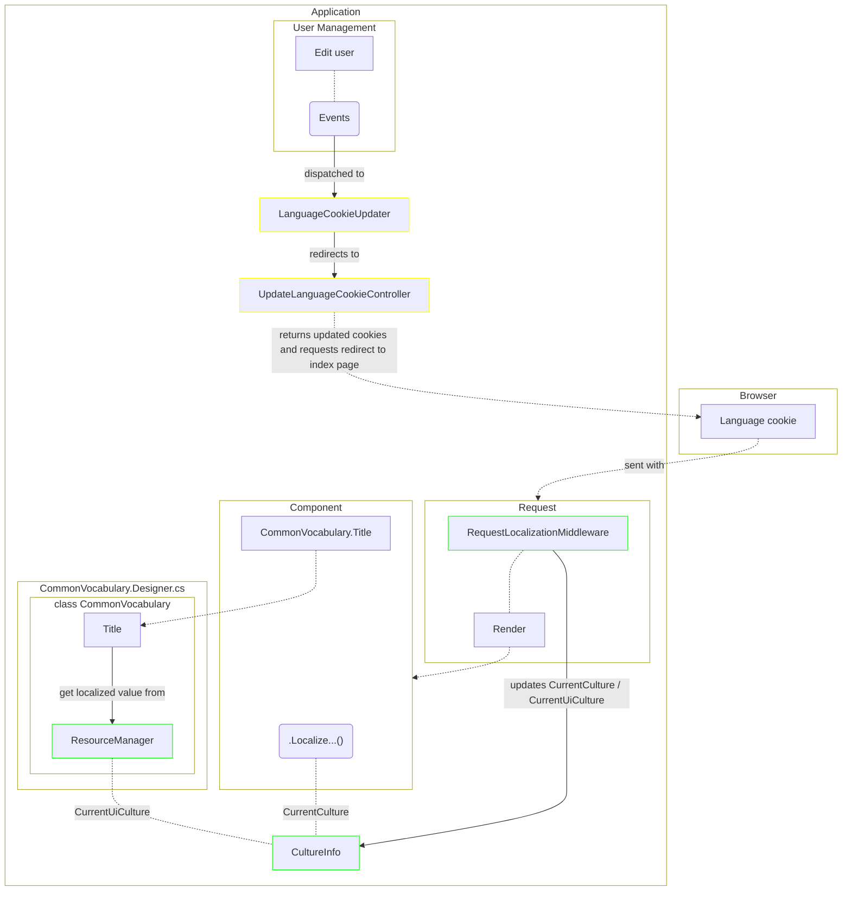

[[_TOC_]]

# Introduction

This document describes the architecture of the localization implementation.

## Overview

```mermaid
flowchart TD
    subgraph Browser
        LanguageCookie["Language cookie"]
    end

    subgraph Application
        subgraph UserManagement["User Management"]
            EditUser["Edit user"]
            Events("Events")

            EditUser-.-Events
        end

        subgraph Component
            SdkLocalizeExtensionMethodCall(".Localize...()")
            CommonVocabularyTitleCall["CommonVocabulary.Title"]
        end

        subgraph DesignerCs["CommonVocabulary.Designer.cs"]
            subgraph CommonVocabularyClass["class CommonVocabulary"]
              ResourceManager
              Title

              Title-- "get localized value from " -->ResourceManager
            end
        end

        subgraph Request
          RequestLocalizationMiddleware
          Render

          RequestLocalizationMiddleware-.-Render
        end

        LanguageCookieUpdater
        UpdateLanguageCookieController
        UserManagement["User Management"]
        CultureInfo
        ResourceManager-. "CurrentUiCulture" .-CultureInfo

        SdkLocalizeExtensionMethodCall-. "CurrentCulture" .-CultureInfo
        CommonVocabularyTitleCall-.->Title


        Render-.->Component
    end

    LanguageCookie-. "sent with" .->Request
    RequestLocalizationMiddleware-- "updates CurrentCulture / CurrentUiCulture" -->CultureInfo

    Events-- "dispatched to" -->LanguageCookieUpdater

    LanguageCookieUpdater-- "redirects to" -->UpdateLanguageCookieController
    UpdateLanguageCookieController-. "returns updated cookies and requests redirect to index page" .->LanguageCookie

    classDef cluster fill:#ffffff10

    classDef suiteServices stroke:#ffff00
    class CurrentUserCultureProvider suiteServices;
    class LanguageCookieUpdater suiteServices;
    class UpdateLanguageCookieController suiteServices;

    classDef microsoftServices stroke:#00ff00
    class RequestLocalizationMiddleware microsoftServices;
    class CultureInfo microsoftServices;
    class ResourceManager microsoftServices;
```
