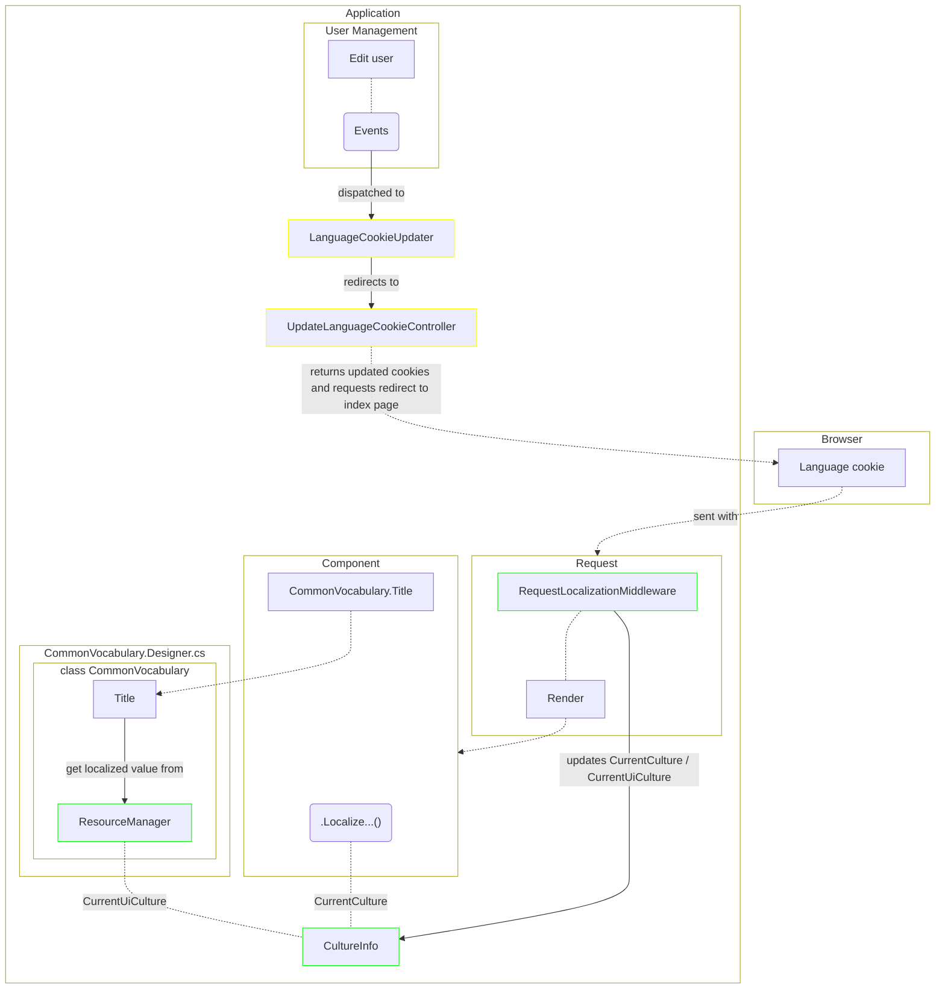
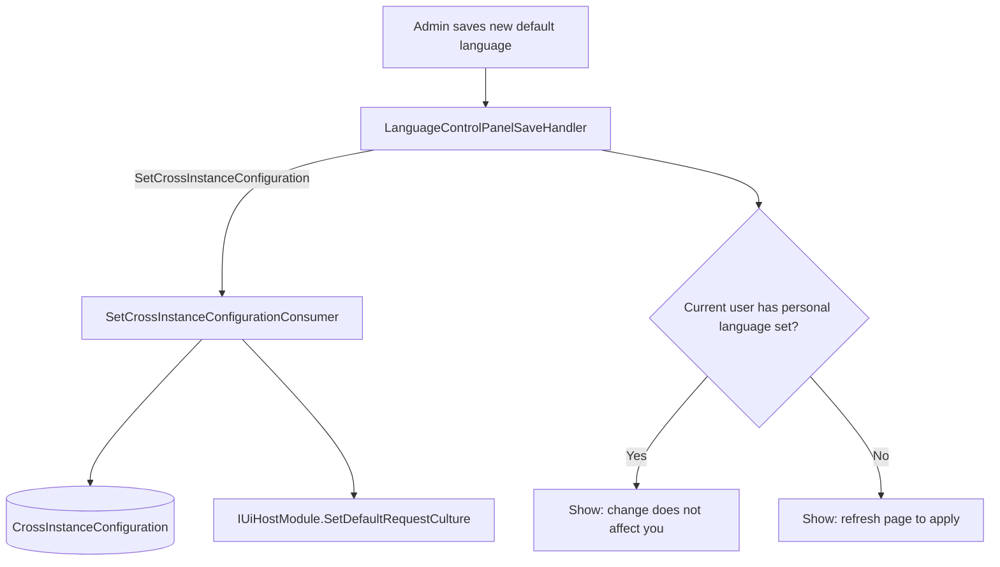

[[_TOC_]]

# Introduction

This document describes the rules and recommendations for the implementation of localized text.

## Overview



## General conventions

- Use of a designer class generated by .NET tooling that fetches localized text automatically
  
  > The origin of this approach was discussed in vicione-oss/vicione/suite-apps/cluster-management/cluster-editor#1230.

- Resource keys should use [PascalCase](https://en.wikipedia.org/wiki/Camel_case) notation as code generated from resource keys should adhere to [C# naming conventions](https://learn.microsoft.com/en-us/dotnet/csharp/fundamentals/coding-style/identifier-names#naming-conventions).

- Resource keys should use English wording

## Common localization

- Localized text that can be shared with other application parts should be stored in one of the following resource files:

    | Resource file                                                                                                                                                                       | Description                                                            |
    |-------------------------------------------------------------------------------------------------------------------------------------------------------------------------------------|------------------------------------------------------------------------|
    | [CommonPhrases](https://gitlab.com/vicione-oss/vicione/ui-libs/localization/-/blob/master/src/ViciOne.Ui.Localization/Resources/CommonPhrases.Designer.cs?ref_type=heads)           | Common vocabulary like `An unknown error occurred`                     |
    | [CommonVocabulary](https://gitlab.com/vicione-oss/vicione/ui-libs/localization/-/blob/master/src/ViciOne.Ui.Localization/Resources/CommonVocabulary.Designer.cs?ref_type=heads)     | Common vocabulary like `Yes` or `No`                                   |
    | [TechnicalAcronyms](https://gitlab.com/vicione-oss/vicione/ui-libs/localization/-/blob/master/src/ViciOne.Ui.Localization/Resources/TechnicalAcronyms.Designer.cs?ref_type=heads)   | Technical [acronyms](https://de.wikipedia.org/wiki/Akronym) like `TCP` |
    | [TechnicalTerms](https://gitlab.com/vicione-oss/vicione/ui-libs/localization/-/blob/master/src/ViciOne.Ui.Localization/Resources/TechnicalTerms.Designer.cs?ref_type=heads)         | Technical terms like `Data port`                                       |
    | [ValidationMessages](https://gitlab.com/vicione-oss/vicione/ui-libs/localization/-/blob/master/src/ViciOne.Ui.Localization/Resources/ValidationMessages.Designer.cs?ref_type=heads) | Validation formats like `{0} is required`                              |

- Resource keys for pluralized text should end with suffix `Plural` to differentiate from the singular term as some english words in the pluralized form do not end with `s`

- Resource keys for abbreviations should end with suffix `Abbreviation`

### Common vocabulary specific rules

- Resource keys for verbs should end with suffix `Verb` when the resource key without the suffix would not be ambiguous

## Specific localization

- Specific localized text for `MyClass.cs` should be stored on the same level in a resource file named `Localization/{MyClass}.resx`. If the text must be accessible on different layers of the suite, then it should be stored in a resource living in [`Localization`](src/Blazor.Shared/Localization) at root level.

## Localization in client modules

In general, the rules mentioned in the sections above should be followed in client modules also.

Additionally, to allow a client module to integrate seamlessly into the suite, some localized texts like title and description of the module must be provided. For this, localization services have to be registered via extension method [`AddLocalization<TClientModule, TClientModuleLocalizer>()`](https://gitlab.com/vicione-oss/vicione/suite/suite-sdk/-/blob/master/src/Sdk.Client/Modules/Localization/Extensions/IServiceCollectionExtensions.cs) to allow the suite to resolve these services at runtime:

``` csharp
internal sealed class  FooClientModuleLocalizer : IClientLocalizer<FooClientModule>
{
  ...
}`
```

``` csharp
public sealed class FooClientModule : ClientModule
{
    ...

    public override Action<IServiceCollection, HostingModel> ConfigureServices => (services, _) =>
    {
        ...

        services.AddLocalization<BurgerModule, FooClientModuleLocalizer>(); 
    };
}
```

## Culture Resolution

The active culture for each request is resolved by ASP.NET Core's `RequestLocalizationMiddleware` using an ordered chain of `IRequestCultureProvider` implementations. The first provider that returns a non-null result wins.

### Provider chain (in priority order)

1. **`CookieRequestCultureProvider`** — reads the language cookie sent by the browser. This is the primary source of truth for per-user culture.
2. **`DefaultRequestCultureProvider`** — a custom fallback provider (`BlazorServerBackendModule.DefaultRequestCultureProvider`) that returns the system-wide default culture stored in `IUiHostModule`. It is consulted only when no cookie is present.

If neither provider supplies a value, the `DefaultRequestCulture` configured on `RequestLocalizationOptions` (always the first entry in `Constants.SupportedCultures`) is used.

## User Culture Evaluation

The culture applied to a given request depends on whether the current user has a personal language preference set on their account.

### Users with a personal language preference

When a user has a language set on their profile, `LanguageCookieUpdater` ensures the language cookie always reflects that preference:

- On circuit initialisation, `LanguageCookieUpdater` reads the user's language from their profile and compares it to the current cookie value.
- If the cookie is missing or holds a different value, the component redirects to `UpdateLanguageCookieController`, which writes the correct cookie and redirects back. This triggers a full HTTP round-trip so the new cookie is picked up by `RequestLocalizationMiddleware` on the next request.
- When the user's language preference changes (via `UserUpdatedEvent`), `LanguageCookieUpdater` reacts to the event and repeats the same redirect flow.
- When the user's language preference is cleared, the cookie is removed so the system default takes effect.

Because the cookie takes priority in the provider chain, a user with a personal language preference is **not affected** by changes to the system-wide default language. The Language control panel communicates this explicitly: after saving a new system default, it checks whether the current user has a language set and, if so, shows an informational banner (`ShowLanguageDoesNotAffectCurrentUser`) instead of the page-refresh prompt.

### Users without a personal language preference

Users without a personal language preference have no language cookie. Their culture is resolved from the `DefaultRequestCultureProvider` fallback, which reads the value stored in `IUiHostModule.GetDefaultRequestCulture()`.

This value is kept up to date in two places:

- **On startup** — `ApplicationWorker.SetCulture` reads the persisted `CrossInstanceConfiguration.CultureName` from the database and calls `IModuleHost.SetUiHostCulture(cultureName)`, which forwards the value to the active `IUiHostModule`.
- **On change** — `SetCrossInstanceConfigurationConsumer` calls `IModuleHost.SetUiHostCulture(cultureName)` immediately after persisting the new configuration, so the in-memory fallback is updated without requiring a restart.

Because the new culture is only applied to subsequent requests (the Blazor Server circuit reuses its render context), the Language control panel shows a page-refresh banner (`ShowPageRefreshInformation`) after a successful save for users in this category.

## System Default Language Change Flow


