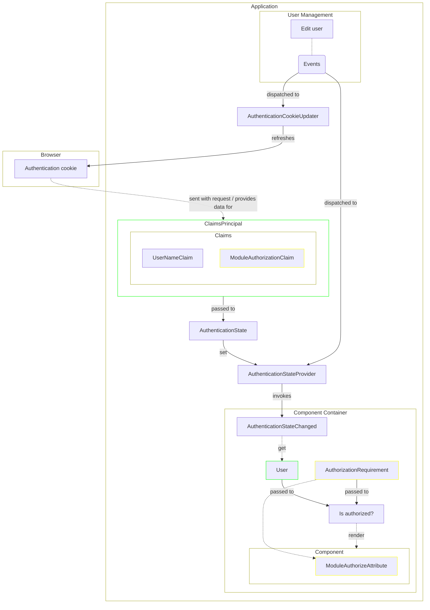

[[_TOC_]]

# Introduction

This document describes security and identity topics.

## Account Lockout

ASP.NET Identity's lockout feature is enabled to slow down online password guessing.

- **Threshold:** 5 failed attempts within the lockout window lock the account.
- **Duration:** 5 minutes; lockout end is auto-extended on each new failure during the window.
- **Auto-unlock only:** there is no admin unlock UI; locked accounts unlock automatically once the window elapses, or implicitly when the user completes a password reset via emailed token.
- **No enumeration:** a locked account surfaces the same generic "user or password is incorrect" message as a wrong password. Callers cannot distinguish locked from invalid.
- **Scope of counter increments:**
  - Password sign-in increments on failure (`SignInManager.PasswordSignInAsync` with `lockoutOnFailure: true`).
  - The "change password" flow checks lockout up front and increments on a wrong current password.
  - Passkey sign-in and external (OIDC) sign-in **respect** an existing lockout but do not increment the counter — those auth paths are not credential-guessing surfaces.
- **Out of scope:**
  - No IP-based rate limiting upstream of Identity; lockout is the only brute-force defense.
  - No protection inside the `UpdateUser` profile-change command path — that consumer calls `ChangePasswordAsync` directly without consulting the lockout state.
  - The bootstrapped system administrator is subject to lockout like any other account.

## Authorization

Propagating changes to a user to frontend components:

## Security Headers

The Content Security Policy itself is decided in [ADR-006](ADRs/ADR-006-content-security-policy.md); this section only records which layer sends which header, and why.

- **The Suite sends the policy and `X-Frame-Options`**, from `ContentSecurityPolicy` and `UseSecurityHeaders`.
  It is the only layer present in every deployment — installations also run Kestrel directly or sit behind a customer-managed proxy — which is what decided it in the ADR.
- **The failsafe and downgrade hosts send a stricter policy of their own**, because they answer when the Suite did not come up.
  They carry no reporting directive — the app that would answer `/csp-report` is the one that failed.
- **The packaged nginx sends HSTS, `X-Content-Type-Options` and `Referrer-Policy`**, and deliberately no CSP and no `X-Frame-Options`.
  A duplicate `X-Frame-Options` may be ignored by the browser altogether, so exactly one sender is the point.
- **`src/html/unavailable.html` in `deb-packaging` needs no CSP exception**, although it carries an inline `<style>` and `<script>`.
  nginx serves it only when the upstream is unreachable, so no policy of the Suite's can be on that response, and nginx sends none of its own.
- **Editing the nginx fragments carries one trap:** an `add_header` inside a `location` discards every server-level `add_header` for that location, so a location added later silently loses HSTS, `nosniff` and `Referrer-Policy` unless each is repeated there.
  `src/nginx/header` carries the same note.

### Deployment

- **TLS is required for violation reporting.** `report-to` registers an endpoint only on a cryptographic origin, and a browser that supports it ignores `report-uri`, so an installation served over plain `http://` reports no violations at all.
  TLS terminated at a proxy is enough, since what counts is the scheme the browser sees — see the remarks on `ContentSecurityPolicy.Baseline`.
- **The policy is identical in every environment.** There is no Development variant, so what E2E exercises is the header a customer gets.
