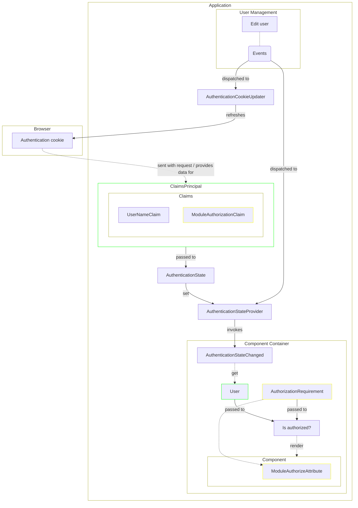

[[_TOC_]]

# Introduction

This document describes security and identity topics.

## Account Lockout

ASP.NET Identity's lockout feature is enabled to slow down online password guessing.

- **Threshold:** 5 failed attempts within the lockout window lock the account.
- **Duration:** 5 minutes; lockout end is auto-extended on each new failure during the window.
- **Auto-unlock only:** there is no admin unlock UI; locked accounts unlock automatically once the window elapses, or implicitly when the user completes a password reset via emailed token.
- **No enumeration:** a locked account surfaces the same generic "user or password is incorrect" message as a wrong password. Callers cannot distinguish locked from invalid.
- **Scope of counter increments:**
  - Password sign-in increments on failure (`SignInManager.PasswordSignInAsync` with `lockoutOnFailure: true`).
  - The "change password" flow checks lockout up front and increments on a wrong current password.
  - Passkey sign-in and external (OIDC) sign-in **respect** an existing lockout but do not increment the counter — those auth paths are not credential-guessing surfaces.
- **Out of scope:**
  - No IP-based rate limiting upstream of Identity; lockout is the only brute-force defense.
  - No protection inside the `UpdateUser` profile-change command path — that consumer calls `ChangePasswordAsync` directly without consulting the lockout state.
  - The bootstrapped system administrator is subject to lockout like any other account.

## Authorization

Propagating changes to a user to frontend components:

