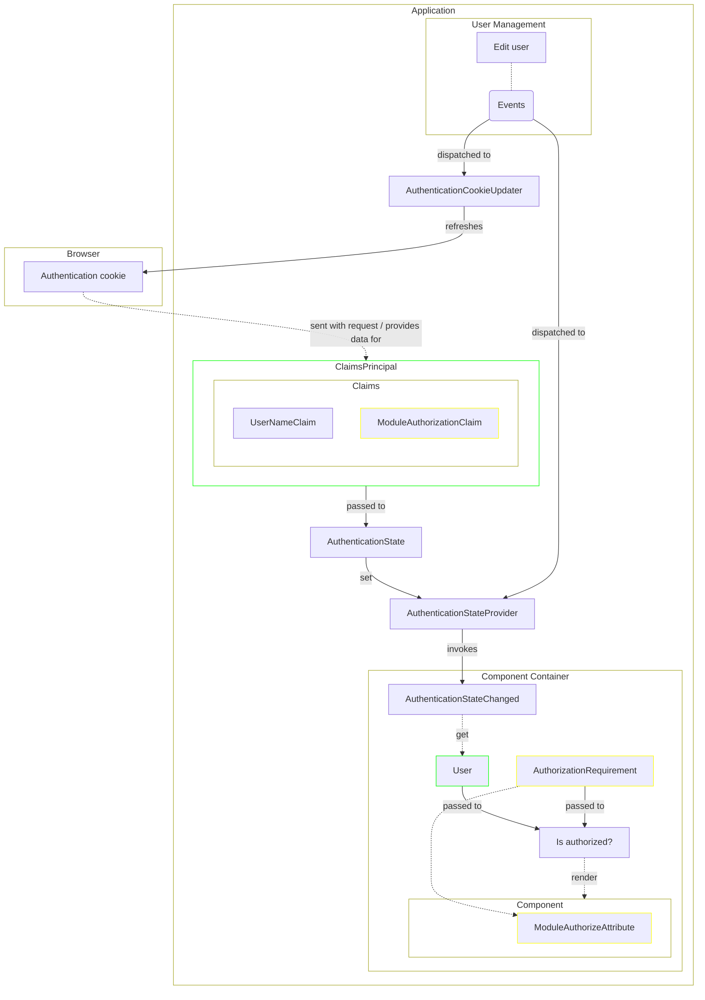

[[_TOC_]]

# Introduction

This document describes security and identity topics.

## Authorization

```mermaid
flowchart TD
    subgraph Browser
        AuthenticationCookie["Authentication cookie"]
    end

    subgraph Application
        subgraph ClaimsPrincipal
            subgraph Claims
                UserNameClaim
                ModuleAuthorizationClaim
            end
        end

        subgraph ComponentContainer["Component Container"]
            subgraph Component
                ModuleAuthorizeAttribute
            end

            AuthenticationStateChanged
            User
            AuthorizationRequirement
            IsAuthorized["Is authorized?"]
        end

        subgraph UserManagement["User Management"]
            EditUser["Edit user"]
            Events("Events")

            EditUser-.-Events
        end

        AuthenticationState
        AuthenticationStateProvider
        AuthenticationCookieUpdater
        UserManagement["User Management"]
    end

    AuthenticationCookie-. "sent with request / provides data for" .->ClaimsPrincipal
    ClaimsPrincipal-- "passed to" -->AuthenticationState
    AuthenticationState-- "set" -->AuthenticationStateProvider

    Events-- "dispatched to" -->AuthenticationStateProvider
    Events-- "dispatched to" -->AuthenticationCookieUpdater

    AuthenticationStateProvider-- "invokes" -->AuthenticationStateChanged
    AuthenticationCookieUpdater-- "refreshes" -->AuthenticationCookie

    AuthenticationStateChanged-. "get" .->User
    User-- "passed to" -->IsAuthorized
    AuthorizationRequirement-.->ModuleAuthorizeAttribute
    AuthorizationRequirement-- "passed to" -->IsAuthorized
    IsAuthorized-. "render" .->Component

    classDef cluster fill:#ffffff10

    classDef authorization stroke:#ffff00
    class ModuleAuthorizeAttribute,AuthorizationRequirement,ModuleAuthorizationClaim authorization;
    
    classDef user stroke:#00ff00
    class ClaimsPrincipal,User user;
```