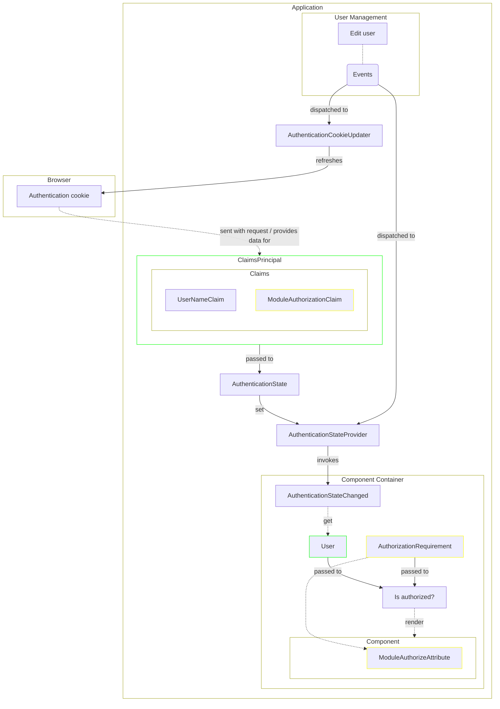

[[_TOC_]]

# Introduction

This document describes security and identity topics.

## Authorization

Propagating changes to a user to frontend components:

# (Security) Architecture Decision Records (ADR)

## [ADR-001] Maintain Local User Authentication using ASP.NET Identity

* **Date:** 2025-10-21
* **Status:** Accepted
* **Security Domain(s):** Authentication, Availability, Data Protection
* **Decision Maker(s):** Development Lead, Security Architect

---

### 1. Context

The application is an ASP.NET web application that requires **high availability and operability** even when deployed in environments with **limited or zero internet connectivity** (offline/air-gapped scenarios). Current industry best practice favors **external identity providers (IdPs)** using protocols like OpenID Connect (OIDC). However, relying solely on an external IdP introduces an **availability risk** where a loss of internet access prevents user authentication and subsequent application use.

* **Problem:** Exclusive reliance on OIDC/external IdPs breaks application availability in offline deployment scenarios.
* **Requirement:** The application must maintain core user authentication functionality regardless of external network connectivity.

---

### 2. Decision

We will use **ASP.NET Identity** with a local database (e.g., SQLite) as the **primary authentication source**.

This approach provides a **local, self-contained authentication and user management system** that meets the high availability requirement for offline scenarios.

* **Implementation Details:**
    * ASP.NET Identity is configured to use the built-in **password hashing mechanism (PBKDF2)** for secure storage of local credentials.
    * The application will be configured to handle local login requests (using username/password credentials) first.
    * Any future integration with external IdPs (e.g., for SSO) will be implemented as a **secondary, optional authentication path** that falls back to local Identity if the external service is unavailable.

---

### 3. Alternatives Considered

| Alternative | Description | Reason for Rejection |
| :--- | :--- | :--- |
| **A. Exclusive External IdP (OIDC)** | Use Azure AD, Okta, or other OIDC providers only. | Fails the primary non-functional requirement of **offline availability**. A network outage would render the application unusable. |

---

### 4. Consequences

| Impact Type | Description |
| :--- | :--- |
| **Positive Security Impact** | Provides a **high-availability authentication mechanism** that is independent of external network status. Uses the **Microsoft-maintained and hardened ASP.NET Identity libraries**, reducing the risk of custom security flaws. |
| **Negative Security Impact** | Introduces the **responsibility of storing and protecting sensitive user credentials** (password hashes) in the application's database. This increases the scope of compliance and data protection requirements (e.g., backup encryption, key rotation). |
| **Operational Impact** | **Simplified deployment** in offline environments, as there are no external service dependencies for login. |
| **Future Risk** | If Single Sign-On (SSO) is required later, a **federation layer** must be added to connect the local Identity system to the external IdP. |

---

## [ADR-002] Direct SMTP Communication via MailKit for High Deployment Flexibility

* **Date:** 2025-10-22
* **Status:** Accepted
* **Security Domain(s):** Availability, Secrets Management, Transport Security
* **Decision Maker(s):** Development Lead, Infrastructure Architect

---

### 1. Context

The application relies on transactional email for core security features (2FA, password recovery, account confirmation) using ASP.NET Identity. Due to the product’s deployment model—being installed on diverse, customer-owned hardware environments (on-premise, air-gapped, internal networks)—the application **cannot rely on a single, external Email-as-a-Service (EaaS) provider** (like SendGrid or AWS SES) for network availability reasons.

* **Problem:** Cloud-based EaaS solutions require external internet access, which is not guaranteed in all customer environments, leading to a critical failure of authentication features.
* **Requirement:** The email sending solution must utilize the customer's existing local/internal SMTP infrastructure, ensuring core security features remain functional regardless of external network access.

---

### 2. Decision

We will implement email sending using the **MailKit** library configured for **direct SMTP communication** via customer-provided credentials.

This approach guarantees the highest degree of compatibility with the customer's existing mail infrastructure, whether it is an on-premise Exchange server or an internal SMTP relay.

* **Implementation Details (Hardening Mandates):**
    1.  **Library:** Use **MailKit** instead of the older `System.Net.Mail` for superior TLS support, modern authentication protocols, and robust error handling.
    2.  **Secrets Management:** SMTP credentials **must** be injected via **OS Environment Variables** at deployment time. They must never be stored in plaintext configuration files or version control.
    3.  **Transport Security:** **TLS encryption (Port 587/STARTTLS)** must be explicitly enforced for all connections.

---

### 3. Alternatives Considered

| Alternative | Description | Reason for Rejection |
| :--- | :--- | :--- |
| **A. Exclusive EaaS Provider** | Use a commercial provider (e.g., SendGrid/Mailgun) via their SMTP or HTTPS API. | **REJECTED - Fails availability mandate.** This solution is unusable in air-gapped or restricted-internet customer environments, compromising core security functionality. |
| **B. Custom Local Credential Storage** | Encrypt the SMTP secrets locally using DPAPI or machine-specific keys. | **REJECTED - Increased complexity and maintenance.** Requires complex logic to manage and rotate local keys, placing a greater security burden on our application and increasing testing complexity across deployment variants. Environment Variables are simpler and equally secure for this scope. |
| **C. Rely on Basic `System.Net.Mail`** | Use the built-in, older .NET SMTP client. | **REJECTED - Security Risk.** `System.Net.Mail` is often deprecated and can be less reliable in enforcing modern TLS standards and handling contemporary SMTP server quirks, posing a risk to credential security during transit. |

---

### 4. Consequences

| Impact Type | Description |
| :--- | :--- |
| **Positive: Availability** | Ensures **100% availability** of 2FA and password recovery in every supported customer environment, regardless of internet connectivity. |
| **Positive: Flexibility** | Provides maximum compatibility with diverse, customer-specific internal mail servers (Exchange, Postfix, internal relays, etc.). |
| **Negative: Security Burden** | The responsibility for **SMTP credential protection** now shifts to the customer's operational security procedures (ensuring the environment variable is secured). |
| **Negative: Deliverability Risk** | We rely on the customer's local SMTP server quality. Issues like poor IP reputation or misconfigured SPF/DKIM on the customer's side may impact email deliverability, which is out of our control. |
| **Operational Impact** | Requires clear documentation and training for the customer on **securely provisioning the SMTP environment variables** during installation. |

---

### 5. References

* MailKit Official Documentation: https://github.com/jstedfast/MailKit
