# Introduction and Goals

This [arc42](https://arc42.de) document focuses on the architecture of the ViciOne suite.
Neighboring systems are only considered as far as it aids the understanding of the Suite architecture.

## Requirements Overview

ViciOne Suite provides a flexible, scalable infrastructure for distributed automation workflows ranging from simple to complex scenarios,
with built-in security and compliance for industry standards.

### Wide variety of deployment setups

The suite was designed to support simple scenarios, like a single home automation setup, up to complex scenarios, like a multi-site industrial automation setup.
To support these scenarios, Suite's architecture supports connecting multiple instances into a cluster.
The Suite itself does not know about the workflows and automations that are executed within its cluster.
It merely provides a platform for these workflows to run on.
The modules installed on the cluster nodes determine the capabilities of the cluster.

## Quality Goals

The following are the most important [Quality Goals](https://quality.arc42.org/articles/iso-25010-update-2023) for ViciOne Suite.

| Quality Goal             | Description                                                                                                                                                                                                 |
|:-------------------------|:------------------------------------------------------------------------------------------------------------------------------------------------------------------------------------------------------------|
| **Recoverability**       | If the hardware of a node has a problem and needs to be replaced, it should be possible to restore it from its previous state. A generated or manual [Instance-ID](#Instance-IDs) can be used for recovery. |
| **Adaptability**         | The system is designed to be adaptable to various use cases, environments, and industries. As well as a wide range of users from beginners to experts.                                                      |
| **Resource Utilization** | The system shall run on limited hardware (Edge S) and hardware with special persistence implications (flash storage)                                                                                        |
| **Extensibility**        | ViciOne Suite provides a base for many possible scenarios and should be able to be extended easily. See [Modules](#Modules).                                                                                |
| **Fault tolerance**      | ViciOne needs to operate as intended despite the presence of hardware or software faults.                                                                                                                   |

# Architecture Constraints

| Constraint                                              | Description                                                                                                                                                           |
|---------------------------------------------------------|-----------------------------------------------------------------------------------------------------------------------------------------------------------------------|
| The system must cope with varying network availability. | Nodes must be offline capable. Each node in a cluster needs to be operable w/o a lasting connection to its master node. This includes for example login capabilities. |
| Global state is consistently available on all nodes.    | Nodes can act independently and logging in to different nodes will offer the same consistent data across the cluster.                                                 |
| Extensibility                                           | The system needs to be highly extensible and support adding of new features.                                                                                          |
| Limited resources                                       | The system must be able to run on a limited number of resources (e.g., RAM, CPU, low number of write cycles on flash drives, ...)                                     |


# Context and Scope


## Business Context

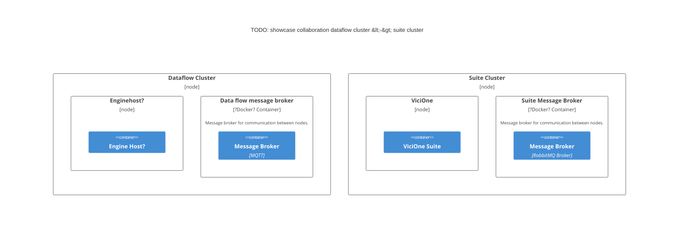

## Technical Context

- **TODO**: Anything here worth documenting? 🤔

# Solution Strategy

| Quality goal         | Scenario                 | Solution approach                                | Link to Details                                                             |
|:---------------------|--------------------------|--------------------------------------------------|-----------------------------------------------------------------------------|
| Recoverability       | Cluster                  | Nodes get their state synchronized               | TBD                                                                         |
| Adaptability         | Cluster/Standalone       | UI can be extended by modules                    | [Module system](#Modules)                                                   |
| Resource Utilization | No writes on flash disks | SQLite is used in-memory on nodes                |                                                                             |
| Resource Utilization | No writes on flash disks | Journal makes sure logs are not written on disks |                                                                             |
| Modularity           | Cluster/Standalone       | Communication over MassTransit                   | [Messaging System](#Interprocess-Communication)                             |
| Modularity           | Cluster/Standalone       | Module system                                    | [Module system](#Modules)                                                   |
| (Data) Integrity     | Cluster                  | Coupling messaging system & persistence          | [Messaging System](#Interprocess-Communication)                             |
| Security             | Cluster/Standalone       | Role based access using ASP.NET Core Identity    | [Role-based security](#Role-based-security: Authorization in ViciOne Suite) |


## Technology Decisions

| Technology      | Purpose                                                                                                     | Rationale                                                                           |
|:----------------|:------------------------------------------------------------------------------------------------------------|:------------------------------------------------------------------------------------|
| **MassTransit** | Implements an transport-idependent, asynchronous, message-based communication strategy to decouple services | Can be used locally and distributed, providing a streamlined development.           |
| **SQLite**      | Used as an in-memory database for slaves and standalone setups                                              | Helps prevent keeping the number of [disk writes](#resource-aware-persistence) down |


# Building Block View

The Building Block View shows the static decomposition of the system into modules and their dependencies.

## White box Overall System (Level 1)

The system is designed as a modular architecture where the core logic is divided into specialized modules that communicate via a shared messaging infrastructure.

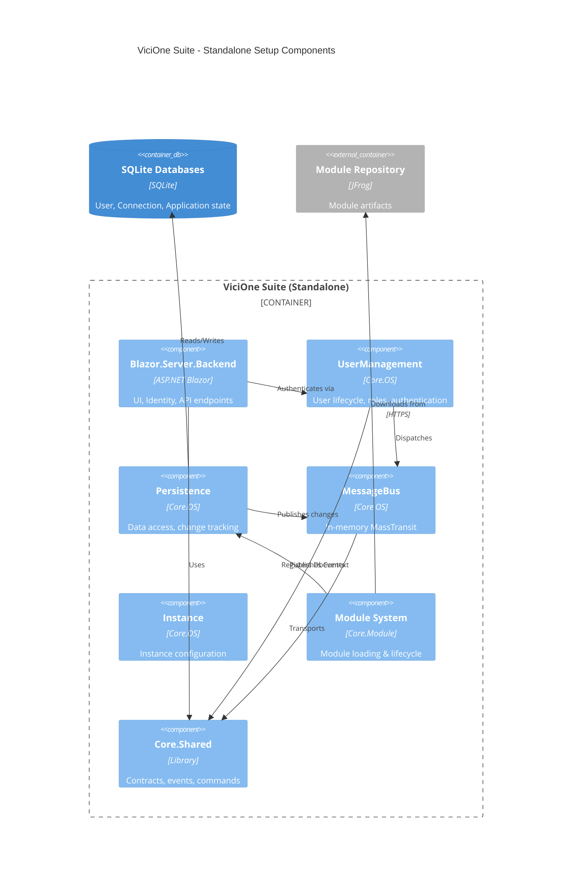

**Contained Building Blocks**

| **Name**                  | **Responsibility**                                                                                                                                                                |
|:--------------------------|:----------------------------------------------------------------------------------------------------------------------------------------------------------------------------------|
| **Core.Deployment**       | Provides deployment-specific SDK references for packaging and distributing the suite to target environments.                                                                      |
| **Core.OS**               | The main application host containing instance management, user management, persistence, messaging (MassTransit), security, connections, and module orchestration.                 |
| **Core.OS.Persistence**   | Ensures data consistency and handles the distribution of data changes. (e.g., interceptors, DbContexts, DbChangeSet)                                                              |
| **Core.Module**           | Handles module discovery, loading, dependency resolution, and lifecycle management. Downloads module artifacts from repositories (JFrog).                                         |
| **Core.Shared**           | Shared contracts, events, commands, and DTOs used across all modules and layers. Defines the messaging interfaces and common domain models.                                       |
| **Core.UiHosting**        | Abstractions for UI hosting (e.g., IUiHostModule, IUiHostEnvironment). Allows modules to register their UI components, configure identity, and integrate with ASP.NET middleware. |
| **Blazor.Server.Backend** | The server-side presentation layer providing Identity UI, API controllers, Blazor components, and security middleware. Serves as the main web host.                               |
| **Blazor.Shared**         | Shared Blazor UI components, dialogs, services, and client-side logic reused across UI modules (authorization, navigation, notifications, wizards, etc.).                         |


# Runtime View


## Register Instance / Nodes joining the cluster

Whenever a node wants to join the cluster, it must register itself.
This is done by sending a `RegisterInstance` command to the master node.

It will then receive a partial update of the data stored on the master, provided that it is not a completely new instance and the last connection to the master occurred within the last five days.
(Configurable via `Core.OS.MessageBus.MassTransit.Configuration.MessageBusOptions.QueueLifetimeInDays`)
In case, the last connection did occur more than five days ago, the node will be considered out of sync, and a full synchronization will be triggered.

If a known instance reconnects during the five-day grace period, the MassTransit queue will still contain its partial updates.

| Event                        | Mode of synchronization |
|------------------------------|-------------------------|
| New instance registers       | Full sync               |
| Re-connect later than 5 days | Full sync               |
| Re-connect within 5 days     | Partial sync            |

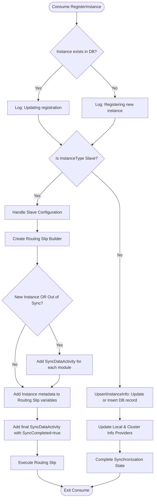

**Remark**
> The flow depicted above is executed independent of the mode.
> `Standalone` and `Master` instances send the command as well, handling them themselves.
> This ensures the workflow is executed regardless of the instance type.

## Syncing the masters DB to nodes in the cluster (Change Tracking Interceptor)

The state stored in the master database is synced to the registered slaves.
This is done for all three databases:

- User database
- Connection database
- Application database

The following chart depicts the general idea of the fan-out sync, triggered by a change:

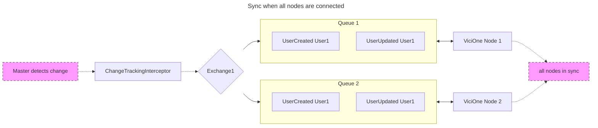

### Sync when a node was not connected during an update

The following chart depicts how the system handles a temporary network outage of one node:

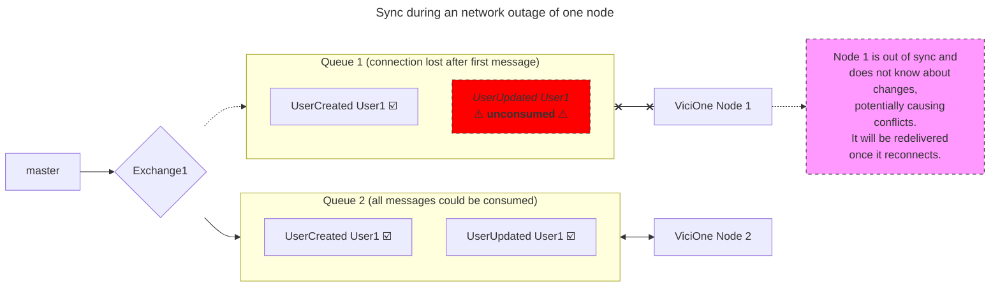
In the scenario above, ViciOne Node 1 was not connected when the update to User1 occurred.
The message will not be lost, but will be redelivered to the node once it reconnects.
(Durable queues are used to ensure that messages are delivered when node connectivity is regained.)

In the meantime, logging in as User1 on Node 1 will have the following issues:
- The user is logged in with deprecated information/roles/permissions.
- Changing user information on Node 1 in the meantime will result in conflicting data.

> These issues are _not_ mitigated actively, and concurrently altering data might result in data being overwritten.

**Potential issues:**

- Over a longer loss of connectivity, messages might pile up in the queue. Leading to a large number of redeliveries
and leading to a high load on the system once it reconnects.
  - Assumption: There might be a big number of messages in the queue. This risk is accepted since the impact is a temporarily slowed down startup.

# Deployment View

To serve in different usage setups, like personal home or industrial automation, ViciOne Suite offers two different installation modes:

- **Standalone setup:** A single instance manages all the functionality and workload.
- **ViciOne Cluster setup:** An arbitrary number of instances form a cluster.

A ViciOne instance has three different modes of operation:
- **Standalone** – The instance operates independently and is not part of a cluster.
- **Master** – The instance is the primary member of a cluster, responsible for coordinating other instances.
- **Slave** – The instance is a secondary member of a cluster, replicating data from a master.

## Standalone setup

When run in standalone mode, the ViciOne Suite operates independently and does not participate in a cluster.
It uses a local database for storing connection, user, and application state.
MassTransit is used in "in-memory" mode.
The standalone setup is suitable for edge devices or environments where a distributed cluster is not required.

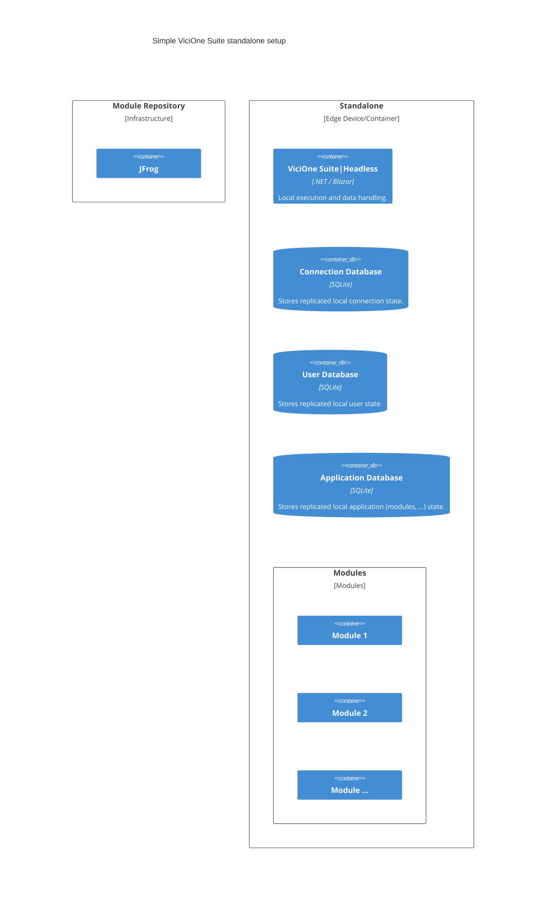

## Cluster setup
One master and multiple slave nodes form a suite cluster.
The following diagram depicts a simple ViciOne cluster setup:

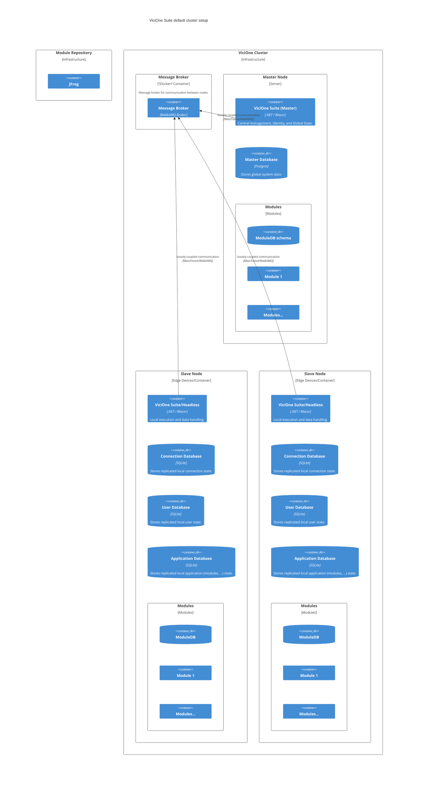
All nodes within the cluster only communicate by sending messages to the message broker.
If a node wants to send a message to another node, it does so by sending a `IInstanceDependentMessage`.
See [messages](#message-types-and-communication-patterns) for further information.


# Cross-cutting Concepts

## Event-Driven Architecture (EDA)

### Communication

#### Communication between nodes

Communication between nodes of the system relies on asynchronous messaging.
Business actions (like user creation) trigger events (`UserCreatedEvent`) rather than direct service calls, allowing for better scalability and loose coupling.

##### Message Types and Communication Patterns

ViciOne implements its **Event-Driven Architecture (EDA)** using **MassTransit** to ensure loose coupling and scalability.
Messages are classified based on their **Scope** (where they are executed) and their **Intent** (what they do).


**Message Scopes**

The scope defines the addressing logic within the cluster:

| Scope                  | Description                                                                                        | Typical Routing                                            |
|:-----------------------|:---------------------------------------------------------------------------------------------------|:-----------------------------------------------------------|
| **Instance Dependent** | Messages targeting a specific, named node (instance).                                              | Routed to a specific instance's unique queue.              |
| **Independent**        | Messages agnostic of which node processes them; they represent global state or master-level logic. | Routed to the "Master" node or a shared pool of consumers. |


##### Message routing

**Consumer registration**

To prevent deviation from the message routing, depending on the mode of an instance, it only registers the following consumers:

| Mode       | Consumers registered                                  |
|------------|-------------------------------------------------------|
| Standalone | All consumers that are not `DbChangeset` consumers    |
| Master     | All consumers that are not `DbChangeset` consumers    |
| Slave      | All instance-dependent messages + `ReadOnlyConsumer`s |


###### Instance Dependent messages

Routing of instance-dependent messages (commands, events, requests) is enabled by each node having a unique [instance ID](#instance-ids).
When an instance is started, its MassTransit/RabbitMQ queues are initialized and named after the instance ID.
There is one queue per instance per message.
Sending a message to the respective queue of an instance is then done by resolving its ID and combining it with the intended message.
The following chart depicts an example:

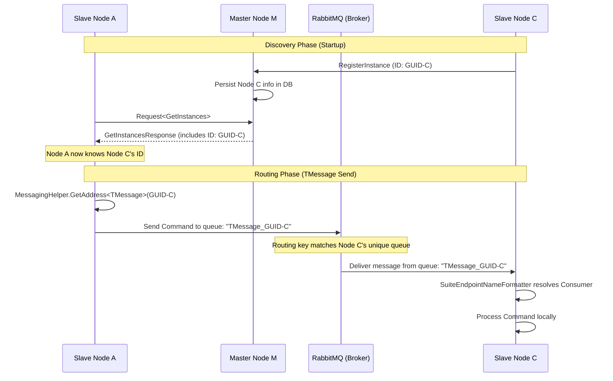

###### (Instance-)independent messages

In the ViciOne Suite, the routing of an instance-independent message follows a "Master-Centric" or "Global Distribution" pattern.
These messages (implementing ICommand or IEvent) represent operations that apply to the system as a whole or to global state (like user management).

- **For Commands:** The system resolves the address to a fixed, shared queue name (e.g., CreateUser). In the SuiteEndpointNameFormatter, the logic explicitly skips the ID-appending step for these types.
- **For Events:** The system uses a Fan-out exchange pattern. The address is the exchange name representing the event type.

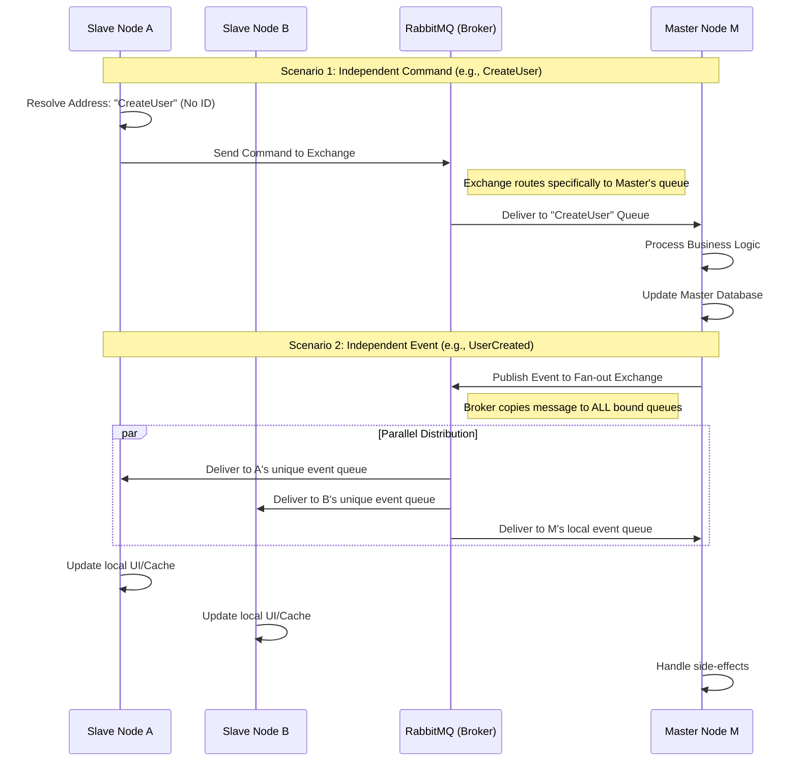

**Key Differences in this Flow:**
- **Commands (Scenario 1):** The address resolution logic in this case omits the Instance ID. Because only the Master node registers consumers for these global commands, the message is effectively "forwarded" to the Master, regardless of which node initiated it.
- **Events (Scenario 2):** Uses a **Fan-out** pattern. The sender (often the Master after a database write operation) doesn't know who the recipients are. RabbitMQ ensures that every node in the cluster that has an interest in that event type receives its own copy.
- **Synchronization:** This independent routing ensures that while actions (Commands) are centralized on the Master to prevent data conflicts, the results (Events) are shared globally to keep all nodes in a consistent state.


**Summary Table: Independent Routing**

| Pattern | Exchange Type | Destination            | Processing Node(s)  |
|---------|---------------|------------------------|---------------------|
| Command | Direct/Fanout | Master's Shared Queue  | Master Only         |
| Event   | Fanout        | Every Registered Queue | All Slaves & Master |
| Request | Direct        | Local or Master        | Exactly One         |

**Message Types by Intent**

###### Commands ("Do something")

Commands represent an instruction to change state or perform a specific action.

*   **Instance Dependent Command**: Directed at a **dedicated instance**. Used for node-specific operations (e.g., triggering a local hardware restart or updating a local configuration file).
*   **Independent Command**: Directed at the **Master node**. Used for system-wide logic, such as central user registration. The master will make sure that it is processed accordingly.

Commands are used in a fire-and-forget style, meaning they will not be returning any data.
When successful there is a corresponding `Event` reporting the command's execution.

###### Events ("Something happened")

Events represent facts that have occurred, often used to trigger side effects or synchronize data.

*   **Independent Event**: Distributed to **all subscribed instances**. Every node in the cluster can have its own consumers for this event. This is used for "Fan-out" updates where every node must react (e.g., a global security policy update).
*   **Instance Event**: These are routed such that they are processed by **exactly one instance** in the cluster.

###### Requests ("Give me information")

Requests follow a Request/Response pattern and are synchronous in nature.

*   **Behavior**: Requests are typically handled **locally** within the process boundary for performance. If the data resides elsewhere, they are directed against a **specific instance** known to hold that data.


##### Specialized Messaging Concepts

###### Data Replication (`DbChangeSet`)

A critical technical message used for keeping the cluster in sync.
*   **Source**: Automatically generated by the `ChangeTrackingInterceptor` after a database transaction is committed.
*   **Routing**: Published to durable queues to ensure that even if a node is offline, it will receive the update upon reconnection.
*   **Goal**: Maintains "Conceptual Integrity" across different module databases.

See [Data Replication](#data-replication)

###### Routing Slips (Orchestration)

Used for complex, multistep workflows like the **Instance Registration** process.
*   **Workflow**: A `RoutingSlipBuilder` dynamically assembles a list of activities (e.g., `SyncDataActivity` for different modules).
*   **Execution**: The system executes these steps sequentially, ensuring that a new or out-of-sync node is fully updated before it is marked as operational.


###### Routing Summary Table

| Pattern                      | Destination                     | Consumed by              |
|:-----------------------------|:--------------------------------|:-------------------------|
| **InstanceDependentCommand** | Specific Node queue             | Recipient node           |
| **IndependentCommand**       | Master queue                    | Master                   |
| **InstanceDependentEvent**   | Sent to specific instance queue | Recipient node           |
| **IndependentEvent**         | Master queue                    | Each consumer registered |
| **InstanceDependentRequest** | Sent to specific instance queue | Recipient node           |
| **Independent Request**      | Handled by the local instance   | Local instance           |


---


#### Internal communication

*[Mediator Pattern](https://refactoring.guru/design-patterns/mediator)* is used to abstract internal communication and dispatch commands/events within a process boundary.
This enables easy extension and testing of building blocks.


### Recoverability/Stability

ViciOne needs to run in environments where a stable connection from its nodes to the rest of the cluster is not always a given.
With this in mind, events cannot always be sent and received by each node at any given time.
ViciOne uses RabbitMQs durable queues to mitigate this.

| Issue                                                                                | Runtime effect                                                                                          | Potential issues                                                            |
|--------------------------------------------------------------------------------------|---------------------------------------------------------------------------------------------------------|-----------------------------------------------------------------------------|
| Temporary loss of connectivity from a node to the message broker                     | As soon as the connection is restored, the messages that arrived in the meantime will then be delivered | Node has to process a lot of messages once the connection is re-established |
| Nodes sending messages during a temporary loss of connectivity to the message broker | **TODO**: To be analyzed.                                                                               |                                                                             |
| Short temporary outage of master                                                     | The messages sent to the master will be stored in the queue and re-delivered as it comes back.          | Master has to process a lot of messages afterwards                          |
| Complete loss of master/messaging queue                                              | Instances operate in read-only mode                                                                     | See [Critical infrastructure](#Critical Infrastructure)                     |


## Cluster-wide State Consistency (Hybrid Consistency Model) / Single source of truth

The ViciOne Suite operates on a hybrid consistency model to balance the "Offline-First" requirement with the "Single Source of Truth" constraint.

*   **Strong Consistency (Write Path):** All global state changes (User management, Instance registration, Module assignments) are directed to the **Master Node**. The Master uses a PostgreSQL database with full ACID transactions. A change is only considered "committed" when it is successfully persisted on the Master.
*   **Eventual Consistency (Read/Replication Path):** Slave nodes maintain a local copy of the relevant global state in their SQLite database. Synchronization is achieved via:
    *   **Live Updates:** The `ChangeTrackingInterceptor` broadcasts `DbChangeSet` events via MassTransit.
    *   **Baseline Resets:** The `RoutingSlip` mechanism (Courier) performs a bulk data synchronization when a node joins or recovers from a long-term outage.
*   **Conflict Resolution:** The "Master-wins" strategy is enforced by the messaging topology. Since Slave nodes forward "Independent Commands" to the Master instead of processing them locally, write-write conflicts are serialized at the Master's database level.


The following chart displays the data synchronization process within a ViciOne Suite cluster, where a master node replicates changes to slave nodes using a message broker.
The diagram illustrates the data flow and command handling between the master and slave nodes.


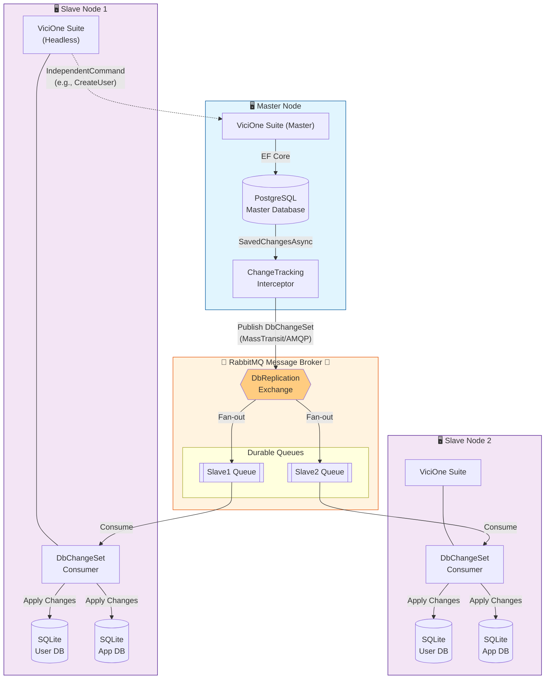


### Data replication (eventual consistency)

Data Replication is implemented via an Interceptor-based specialized `ChangeTrackingInterceptor` that captures database changes to contexts that implement `Sdk.Backend.Persistence.IModuleDbContext` at the EF Core level and publishes them as a `DbChangeSet`.
This ensures that data updates can be replicated across the system without manual intervention in business logic.

Writing to a clusters database is only done by its master node and then replicated to the nodes within the cluster.
The changes written on the master are then sent to the nodes using MassTransit.
Its durable queues make sure that changes are applied throughout the cluster in the correct order.

This approach leads to **eventual consistency**, which allows for temporarily desynced nodes, e.g. in case of connection loss.
Once the node comes online again, it catches up and is consistent again.
Messages will be kept for a configurable time and discarded afterwards.
In this case, a full sync of the data is detected and initiated by the master.

To prevent slaves from consuming any messages until their local database is fully synced, its startup process prevents the messages not involved in the registration being processed.

#### Automatic Data Replication (Interception Flow)

This scenario describes how the system automatically detects database changes and propagates them as events to ensure conceptual integrity across modules.
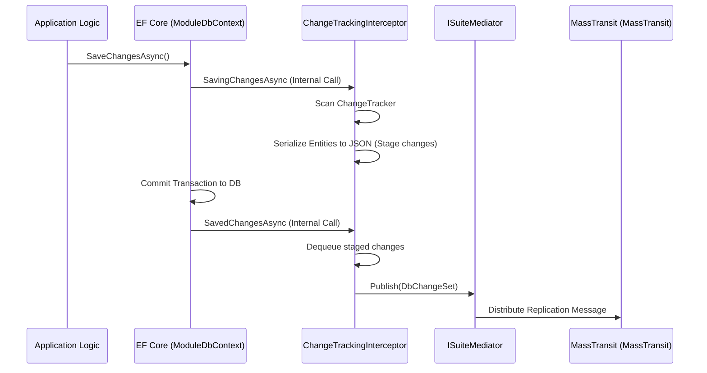

Notable Aspects:
- **Transactional Integrity**: The DbChangeSet is only published in SavedChangesAsync, which occurs after the database has successfully committed the transaction.
- **Filtering**: The ChangeTrackingInterceptor uses GetIgnoredEntities to skip entities marked as "NotSynchronized" or internal relations, preventing circular replication loops.
- **Master only**: only master instances have the interceptor running. Changes in other instance types will not be recognized by this mechanism.

**Known limitations:**
- bulk operations (update) are not supported.
    - not recognized in change tracking interceptor
- shadow properties are not supported.
- certain data types (e.g., those that cannot be serialized to JSON) are not supported.


### Core Problems Addressed
1. Network Failures & Node Downtime
    - Durable queues persist messages when slaves are offline
    - Messages wait in RabbitMQ until nodes reconnect
    - No data loss during network outages or restarts
2. Message Ordering
    - Dedicated queue per slave ensures FIFO processing
    - Changes replayed in the exact commit order from master
    - Prevents "update before create" race conditions
3. Stale Nodes (Long Disconnections)
    - Queue TTL (5 days) prevents message buildup
    - Routing Slips trigger full re-sync for out-of-date nodes
    - Automatic detection via LastRegistered timestamp
4. Split-Brain / Conflicting Writes
    - Master-only writes: Slaves forward all global state changes via IndependentCommand
    - Slaves only process local reads from SQLite replicas
    - A single source of truth prevents divergent state
5. Partial Failures
    - Automatic retries with exponential backoff
    - Dead letter queues isolate poison messages
    - Routing Slip orchestration ensures atomic multistep syncs
6. Debugging & Traceability
    - Correlation IDs propagate through all messages and logs
    - End-to-end tracking from master transaction → slave application
    - Clear fault visibility via RoutingSlipFaulted events


## Modules

To enable the required extensibility, ViciOne Suite uses a modular architecture with a centralized module management system.
This module system allows for features being added in the form of modules that can be loaded into a ViciOne instance.
Modules can extend both the frontend and the backend functionality.
ViciOne offers to search a connected modules repository (jfrog), which then can be downloaded and loaded into the instance.

See [modules.md](modules.md) for more details.

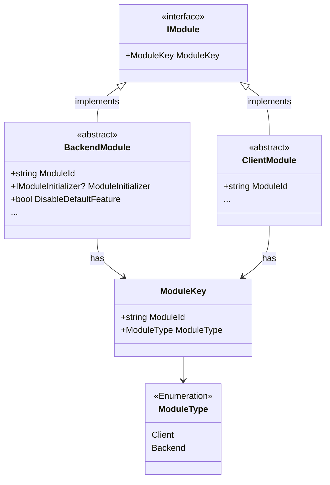
The chart above depicts the basic structure of module components that are offered by the SDK.

**Module ID**

Modules are identified within ViciOne Suite by their module ID.
The ID is derived from the module's assembly name:

| Assembly name                    | Derived module ID    |
|----------------------------------|----------------------|
| **ViciOne.Suite.Module.Backend** | ViciOne.Suite.Module |
| **ViciOne.Suite.Module.Client**  | ViciOne.Suite.Module |

### Modules (backend)

Modules can use the database of the instance for persistence and MassTransit for communication to other modules or instances.

**Persistence**

The primary way for modules to persist data is through the instance's database using Entity Framework.
This database can be SQLite or PostgreSQL, depending on the instance configuration.
Modules need to support both technologies by implementing `Sdk.Backend.Persistence.ISqliteDbContext` as well as `Sdk.Backend.Persistence.IPostgresDbContext`.

ViciOne Suite will make sure that the databases are migrated through its lifecycle methods on `Sdk.Backend.Modules.IModuleInitializer`.

**Communication**

By implementing `Sdk.Backend.Modules.BackendModule.ConfigureMessageBus`, modules can define their message bus configuration.

#### Lifecycle

Modules installed in an instance are loaded when the instance process starts.
The following diagram illustrates the lifecycle of modules within ViciOnes startup:

```mermaid
flowchart TD
    Start([Module Registration]) --> Init[Module Instance Created]
    Init --> ResolveId[Resolve ModuleId from Type]

    ResolveId --> ConfigServices[ConfigureServices Called]
    ConfigServices --> |Register module-specific services| ServiceReg[Services Registered to DI Container]

    ServiceReg --> ConfigBus{Has Message Bus?}
    ConfigBus --> |Yes| BusConfig[ConfigureMessageBus Called]
    ConfigBus --> |No| CheckInit
    BusConfig --> CheckInit{Has ModuleInitializer?}

    CheckInit --> |Yes| PreMigrate[OnPreMigrate Called]
    CheckInit --> |No| UseServices

    PreMigrate --> |Validate config, prepare resources| Migrate[Migrate Called]
    Migrate --> |Apply EF migrations/schema updates| PostMigrate[OnPostMigrate Called]
    PostMigrate --> |Seed data, build caches| OnInit[OnInitialized Called]
    OnInit --> |Final startup logic| UseServices

    UseServices[UseServices Called]
    UseServices --> |Configure middleware pipeline| MapEndpoints[MapEndpoints Called]
    MapEndpoints --> |Register HTTP endpoints| ResourceDir{Has Resource Directory?}

    ResourceDir --> |Yes| LoadResources[Load Embedded/Static Resources]
    ResourceDir --> |No| Ready
    LoadResources --> Ready

    Ready([Module Running])

    style Start fill:#90EE90
    style Ready fill:#90EE90
    style PreMigrate fill:#FFE4B5
    style Migrate fill:#FFE4B5
    style PostMigrate fill:#FFE4B5
    style OnInit fill:#FFE4B5
    style ConfigServices fill:#87CEEB
    style BusConfig fill:#87CEEB
```
### UI

Modules are able to extend the UI of the suite by defining components that will be discovered by the SDK code.
For example, it is possible to add navigation tiles to the start page, or pages that can be navigated to.
Modules hook into the UI of the suite by implementing `Sdk.Client.Modules.ClientModule`, which provides the required lifecycle methods.
There, a module can register its services and UI component, e.g.:
- **Navigation tiles:** the tiles displayed on the starting page
- **Notification elements:** a notification element with support for an icon, optional badge, and flyout
- **Control panels:** components that enable configuration of the modules configuration or other data


## Role-based-security: Authorization in ViciOne Suite

The ViciOne Suite implements a **module-based authorization system** using ASP.NET Core's authorization framework with custom components tailored for modular architecture.

### Core Authorization Concepts

**Roles and permissions**

ViciOne uses ASP.NET Core role [concept](https://learn.microsoft.com/en-us/aspnet/core/security/authorization/roles?view=aspnetcore-10.0).
Suite users can belong to multiple roles, while a role can have multiple permissions (which map to [claims](https://learn.microsoft.com/en-us/aspnet/core/security/authorization/claims?view=aspnetcore-10.0)).

#### Permissions

Authorization is based on **permissions** that grant users specific access levels to modules and their features:
Permissions are defined for `ModuleId`, (optional `FeatureName`) and grant a certain `AccessLevel`.


**Access Levels**:
  - `None` - No access
  - `Partial` - Limited access to features
  - `Full` - Complete access to all features

**Mapping to claims**

To use permissions with ASP.NET Identity, they need to be mapped to `System.Security.Claims.Claim`s.
Claims are basically key-value pairs that can be associated with a user or role.
For the key ViciOne uses `http://schemas.vicione.com/ws/2025/03/identity/claims/moduleauthorization`.
The value is a JSON string that contains the permission details.

**Examples**

To have full access to the systems log viewer, a user needs the following permission:

```json
{
  "ModuleId" : "System",
  "FeatureName" : "Log viewer",
  "AccessLevel" : 1
}
```

To have partial access, the following permissions would be stored:
```json
{
  "ModuleId" : "System",
  "FeatureName" : "Log viewer",
  "AccessLevel" : 0
}
```

A user not having any access, the respective claim would not be associated with the respective user.

#### ModuleAuthorizeAttribute

Components and pages use the `ModuleAuthorizeAttribute` to declare their authorization requirements:

```csharp
[ModuleAuthorize("System", AccessLevel.Full, featureName: "Log Viewer")]
public partial class UpdateControlPanel : ComponentBase
```

This attribute declares:
- Which **module** the component belongs to
- The **minimum access level** required
- Optionally, a specific **feature name** within the module

If the required access rights for this component are not found for the user, access will be denied.

#### Authorization Flow

The following diagram illustrates the authorization flow:

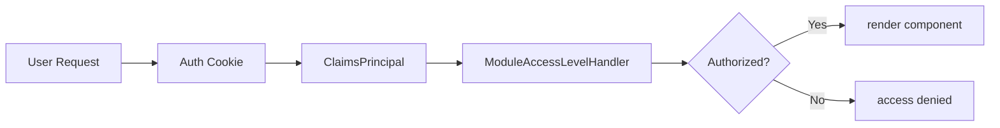


The authorization process:

1. **Authentication Cookie** contains user identity and claims
2. **ClaimsPrincipal** is constructed from the cookie
3. **ModuleAccessLevelHandler** evaluates if the user has the required claim

### Key Components

| Component                           | Responsibility                                                                    |
|:------------------------------------|:----------------------------------------------------------------------------------|
| **ModuleAccessLevelHandler**        | Evaluates whether a user's claims satisfy the module's access level requirements  |
| **AccessLevelPolicyProvider**       | Dynamically creates authorization policies from module IDs and access levels      |
| **IModuleAuthorizationClaimParser** | Parses claim strings to extract module ID, feature name, and access level         |
| **ModuleAuthorizeAttribute**        | Declarative attribute applied to components to specify authorization requirements |

### Authorization Rules

- **Partial Access**: User must have `Partial` or `Full` access
- **Full Access**: User must have exactly `Full` access
- **Feature-Specific**: Claims can target specific features within a module (e.g., "LogView")
- **Module-Level**: If no feature is specified, authorization applies to the entire module

### Real-time Updates

When user permissions change:

1. **UserManagement** dispatches events
2. **AuthenticationStateProvider** receives the events
3. **AuthenticationCookieUpdater** refreshes the authentication cookie
4. **AuthenticationStateChanged** event triggers component re-evaluation
5. Components automatically re-render based on updated permissions

This ensures that UI components immediately reflect permission changes without requiring the user to log out and back in.

## Architectural Observability & Traceability

Given the asynchronous nature of the system, tracking a single operation (like registering a node) across multiple boundaries is critical for maintainability.

*   **Correlation IDs:** MassTransit automatically propagates `CorrelationId` headers across all messages. Every log entry produced by a Consumer or Service includes this ID, allowing developers to trace the lifecycle of a `RegisterInstance` command through its subsequent `RoutingSlip` activities.
*   **Health Monitoring:** Instead of active polling, the cluster uses a "Push-based Health" concept. Every instance is responsible for publishing its own `InstanceHealthInfo`. The `ClusterInformationConsumer` on other nodes listens to these heartbeats to update local `InMemoryClusterInformationProvider` caches, ensuring the UI reflects the cluster state with minimal latency.

## Resource Aware Persistence

The ViciOne needs to run on small machines, and therefore operate with minimal resources.
The minimal hardware the system is intended to run on is the [ifm Edge s](https://www.ifm.com/de/de/shared/produkte/iiot-devices/gateway-s).

As supported hardware uses flash storage, which has [limited write cycles](https://en.wikipedia.org/wiki/Flash_memory#Limitations), it is important to limit the number of writes to ensure longevity and reliability.

To fulfill the quality goal of **Resource Utilization** on hardware with flash storage:

*   **Write Batching:** The `ChangeTrackingInterceptor` aggregates multiple entity changes within a single transaction into a single `DbChangeSet` message.
*   **Filtered Replication:** Only business-critical state is replicated. Internal metadata, transient session data, and logs are excluded from the replication exchange to minimize write cycles on the Slave nodes' SQLite databases.
*   **In-Memory Providers:** Frequently accessed cluster metadata is held in memory (e.g., `InMemoryClusterInformationProvider`) and only updated via events, reducing the need for constant disk I/O for read operations.
*   **Journal:** Logs are written into the linux journal. [ViCiOne.Journal](https://gitlab.com/vicione-oss/vicione/libs/journal) makes sure that logging does not write, system monitoring is utilized to monitor hardware and resource usage

## Instance-IDs

### Purpose

An Instance ID is a `Guid` that uniquely identifies each ViciOne Suite node within a cluster or standalone deployment.
It serves as the primary identifier for message routing, data synchronization, and instance recovery.

### How are Instance IDs Created?

Instance IDs are created during the first startup of a ViciOne instance and stored in a file called `InstanceId.info` in the instance's home directory:

| Instance Type          | Creation Method                                                                    |
|:-----------------------|:-----------------------------------------------------------------------------------|
| **Master**             | Uses a constant, well-known GUID (`6151CF7C-0FBB-44DF-9CAC-D719C62315C9`)          |
| **Slave / Standalone** | Either auto-generated or preloaded via configuration (`InstanceOptions.IdPreload`) |

Once created, the Instance ID file is **not allowed to be modified** during runtime — it becomes static after the first read.

### How are Instance IDs Used?

1. **Message Routing** – Instance-dependent messages are routed to specific nodes using their Instance ID as the queue address.

2. **Instance Registration** – When a node joins a cluster, it sends a `RegisterInstance` command containing its Instance ID. The master tracks all instances in the `InstanceInfo` database table.

3. **Data Synchronization** – The master determines whether a node is new or out-of-sync by looking up its Instance ID and `LastRegistered` timestamp.

4. **Recovery** – If hardware fails, an instance can be restored on new hardware by preloading the same Instance ID via configuration. This allows the new node to "inherit" the identity of the old one and receive queued messages.

### Configuration

Instance IDs can be preloaded via the `Instance` configuration section:

```json
{
  "Instance": {
    "Type": "Slave",
    "IdPreload": "your-predefined-guid-here"
  }
}
```


# Architecture Decisions


## (Security) Architecture Decision Records (ADR)

### [ADR-001] Maintain Local User Authentication using ASP.NET Identity

* **Date:** 2025-10-21
* **Status:** Accepted
* **Security Domain(s):** Authentication, Availability, Data Protection
* **Decision Maker(s):** Development Lead, Security Architect

---

#### 1. Context

The application is an ASP.NET web application that requires **high availability and operability** even when deployed in environments with **limited or zero internet connectivity** (offline/air-gapped scenarios). Current industry best practice favors **external identity providers (IdPs)** using protocols like OpenID Connect (OIDC). However, relying solely on an external IdP introduces an **availability risk** where a loss of internet access prevents user authentication and subsequent application use.

* **Problem:** Exclusive reliance on OIDC/external IdPs breaks application availability in offline deployment scenarios.
* **Requirement:** The application must maintain core user authentication functionality regardless of external network connectivity.

---

#### 2. Decision

We will use **ASP.NET Identity** with a local database (e.g., SQLite) as the **primary authentication source**.

This approach provides a **local, self-contained authentication and user management system** that meets the high availability requirement for offline scenarios.

* **Implementation Details:**
    * ASP.NET Identity is configured to use the built-in **password hashing mechanism (PBKDF2)** for secure storage of local credentials.
    * The application will be configured to handle local login requests (using username/password credentials) first.
    * Any future integration with external IdPs (e.g., for SSO) will be implemented as a **secondary, optional authentication path** that falls back to local Identity if the external service is unavailable.

---

#### 3. Alternatives Considered

| Alternative | Description | Reason for Rejection |
| :--- | :--- | :--- |
| **A. Exclusive External IdP (OIDC)** | Use Azure AD, Okta, or other OIDC providers only. | Fails the primary non-functional requirement of **offline availability**. A network outage would render the application unusable. |

---

#### 4. Consequences

| Impact Type | Description |
| :--- | :--- |
| **Positive Security Impact** | Provides a **high-availability authentication mechanism** that is independent of external network status. Uses the **Microsoft-maintained and hardened ASP.NET Identity libraries**, reducing the risk of custom security flaws. |
| **Negative Security Impact** | Introduces the **responsibility of storing and protecting sensitive user credentials** (password hashes) in the application's database. This increases the scope of compliance and data protection requirements (e.g., backup encryption, key rotation). |
| **Operational Impact** | **Simplified deployment** in offline environments, as there are no external service dependencies for login. |
| **Future Risk** | If Single Sign-On (SSO) is required later, a **federation layer** must be added to connect the local Identity system to the external IdP. |

---


### [ADR-002] Direct SMTP Communication via MailKit for High Deployment Flexibility

* **Date:** 2025-10-22
* **Status:** Accepted
* **Security Domain(s):** Availability, Secrets Management, Transport Security
* **Decision Maker(s):** Development Lead, Infrastructure Architect

---

#### 1. Context

The application relies on transactional email for core security features (2FA, password recovery, account confirmation) using ASP.NET Identity. Due to the product’s deployment model—being installed on diverse, customer-owned hardware environments (on-premise, air-gapped, internal networks)—the application **cannot rely on a single, external Email-as-a-Service (EaaS) provider** (like SendGrid or AWS SES) for network availability reasons.

* **Problem:** Cloud-based EaaS solutions require external internet access, which is not guaranteed in all customer environments, leading to a critical failure of authentication features.
* **Requirement:** The email sending solution must utilize the customer's existing local/internal SMTP infrastructure, ensuring core security features remain functional regardless of external network access.

---

#### 2. Decision

We will implement email sending using the **MailKit** library configured for **direct SMTP communication** via customer-provided credentials.

This approach guarantees the highest degree of compatibility with the customer's existing mail infrastructure, whether it is an on-premise Exchange server or an internal SMTP relay.

* **Implementation Details (Hardening Mandates):**
    1.  **Library:** Use **MailKit** instead of the older `System.Net.Mail` for superior TLS support, modern authentication protocols, and robust error handling.
    2.  **Secrets Management:** SMTP credentials **must** be injected via **OS Environment Variables** at deployment time. They must never be stored in plaintext configuration files or version control.
    3.  **Transport Security:** **TLS encryption (Port 587/STARTTLS)** must be explicitly enforced for all connections.

---

#### 3. Alternatives Considered

| Alternative | Description | Reason for Rejection |
| :--- | :--- | :--- |
| **A. Exclusive EaaS Provider** | Use a commercial provider (e.g., SendGrid/Mailgun) via their SMTP or HTTPS API. | **REJECTED - Fails availability mandate.** This solution is unusable in air-gapped or restricted-internet customer environments, compromising core security functionality. |
| **B. Custom Local Credential Storage** | Encrypt the SMTP secrets locally using DPAPI or machine-specific keys. | **REJECTED - Increased complexity and maintenance.** Requires complex logic to manage and rotate local keys, placing a greater security burden on our application and increasing testing complexity across deployment variants. Environment Variables are simpler and equally secure for this scope. |
| **C. Rely on Basic `System.Net.Mail`** | Use the built-in, older .NET SMTP client. | **REJECTED - Security Risk.** `System.Net.Mail` is often deprecated and can be less reliable in enforcing modern TLS standards and handling contemporary SMTP server quirks, posing a risk to credential security during transit. |

---

#### 4. Consequences

| Impact Type | Description |
| :--- | :--- |
| **Positive: Availability** | Ensures **100% availability** of 2FA and password recovery in every supported customer environment, regardless of internet connectivity. |
| **Positive: Flexibility** | Provides maximum compatibility with diverse, customer-specific internal mail servers (Exchange, Postfix, internal relays, etc.). |
| **Negative: Security Burden** | The responsibility for **SMTP credential protection** now shifts to the customer's operational security procedures (ensuring the environment variable is secured). |
| **Negative: Deliverability Risk** | We rely on the customer's local SMTP server quality. Issues like poor IP reputation or misconfigured SPF/DKIM on the customer's side may impact email deliverability, which is out of our control. |
| **Operational Impact** | Requires clear documentation and training for the customer on **securely provisioning the SMTP environment variables** during installation. |

---

#### 5. References

* MailKit Official Documentation: https://github.com/jstedfast/MailKit


# Quality Requirements

## Quality Requirements Overview

TBD

## Quality Scenarios

None yet.

# Risks and Technical Debts

## Critical infrastructure

In a cluster, the **master node** and the **RabbitMQ messaging queue** are essential for the ViciOne system to function.
Both are required and expected to be functional.

**Assumptions**
- Message queue and master are **highly** available.
- This is highly influenced by the infrastructure chosen to operate the cluster. **Both instances are taken into special consideration**

## Trust policy

Currently, the system operates on **"trust by default"** rather than **"zero trust"**, meaning that there are assumptions on how safe certain sources and environments are:

| Source                    | Description                                                                                                   | Potential issues                                                  | Assumption                                   |
|---------------------------|---------------------------------------------------------------------------------------------------------------|-------------------------------------------------------------------|----------------------------------------------|
| Messaging queues          | Messages coming through the messaging queues, especially those coming from the master are trusted by default. | Tampered messages will be processed                               | Access to rabbitmq is protected and secured. |
| Data read from master DB  | The database structures from the master are serialized and sent to the slaves, where they are applied.        | SQL injection from data read from database                        | No harmful data is stored in masters DB      |
| Modules installed locally | Modules will be loaded if found in the respective path.                                                       | Placing malicious modules in instances will load and execute them | Access control to the machine is in place    |


## Messaging

### Potential issues in communication

While the "Queue per instance" approach provides strong isolation and type safety, several challenges and risks can arise in a distributed environment like the ViciOne Suite:

**Orphaned Queues (Stale Data)**

If a slave node is permanently removed or replaced with a new `InstanceId` without being properly decommissioned:
*   Its specific queues (e.g., `Command_OldID`) remain on the broker.
*   The Master might continue to route messages to these orphaned queues.
*   **Mitigation:** The system uses an `x-expires` argument (configured in `MassTransitConfiguration.cs`) to automatically delete queues after a certain period of inactivity (defaulting to the `QueueLifetimeInDays` setting).

**"Black Hole" Routing**

Since routing is deterministic based on the `InstanceId`, a sender (Node A) will successfully "send" a message to a queue address (e.g., `ModuleXCommand_NodeC`) even if Node C has recently uninstalled "Module X."
*   The message will sit in the queue indefinitely or be moved to a `_skipped` queue on Node C, with the sender receiving no immediate feedback that the recipient is no longer capable of processing that specific command.
* **Mitigation:** Messages have a lifetime and will be automatically deleted by RabbitMQ after a certain period of inactivity (defaulting to the `QueueLifetimeInDays` setting).

**Deployment Drift**
If Node A and Node C are running different versions of the same module:
*   Node A might send a version of a command that Node C's consumer no longer recognizes (or vice versa).
*   Because the queue names are tied to the type name but not the version, the message will be delivered but will fail during deserialization or be moved to the `_error` queue.
* **Possible solution**: update the entire cluster and pause processing until all nodes are at the same version. (not yet implemented)


## Incompatibility within the cluster

**Assumption** The cluster is updated homogeneous, meaning that all nodes are running the same version of the Suite.

## Duplicate instance IDs

Instance IDs need to be unique and collision-free to ensure proper recovery and avoid data inconsistencies.
As they can be set manually, it might be possible to generate collisions.
On a technical level, that would lead to two instances existing with the same ID, but only one receiving messages directed to the instance (ID).
As using the same ID for different instances is the base for being able to recover the instance, for example, on new hardware after a failure,
the system cannot distinguish between an instance recovering and an instance having the same ID by accident.
To mitigate this risk, the user is warned in the respective section of the documentation.

- **Probability**: low
- **Effect**: medium to high, instances with colliding IDs might not receive all messages intended to be sent to them, leading to data inconsistencies and undefined system behavior.

## Non-repudiation

Non-repudiation as the ability to prove that a message or action was sent by a specific user, is not yet implemented in the current version of the system.
Some business sectors might require non-repudiation.

## Modules

- **Security implication**: Currently DLLs from modules are loaded w/o checking their signature.
- **Limitation**: the lifecycle of modules is started upon instance startup. Adding new modules therefore requires a restart of the instance.
- **No sandbox**: There is no mechanism to limit what modules can do and what they can access. Modules can potentially access sensitive data and perform unauthorized actions. Issues could arise from deliberate actions or even by mistake: e.g., two modules declaring the same frontend route or database table can lead to unexpected behavior. See `Core.OS.Modules.Services.ModuleHost.MigrateAndSeedModuleData`

# Glossary

**Contents**


| Term                           | Definition                                                                                                                                                       |
|--------------------------------|------------------------------------------------------------------------------------------------------------------------------------------------------------------|
| **AccessLevel**                | An enumeration defining the granularity of permissions (e.g., `Full`, `Partial`) assigned to users or roles for specific module features.                        |
| **ChangeTrackingInterceptor**  | An Entity Framework Core interceptor that automatically detects changes in the `ChangeTracker` and stages them for distribution via messaging.                   |
| **Cluster management**         | Component managing the data flow and engine hosts. Uses MQTT for communication.                                                                                  |
| **CorrelationId**              | A unique identifier attached to messages and logs that allows tracking a single request or operation across multiple services and components.                    |
| **Dataflow management**        | Now named cluster management.                                                                                                                                    |
| **DbChangeSet**                | A data structure used for replication that captures a collection of entity modifications (inserts, updates, deletes) within a single database transaction.       |
| **Headless mode**              | a ViciOne instance that does not offer an UI                                                                                                                     |
| **IModuleDbContext**           | A specialized database context interface that enforces isolation for functional modules and provides hooks for cross-cutting persistence features.               |
| **ISuiteMediator**             | A project-specific abstraction for the Mediator pattern used to dispatch commands and events within a process boundary.                                          |
| **Instance**                   | A instance of the ViciOne suite running in any mode. Could be a instance offering a UI or an instance running in headless mode.                                  |
| **Journal**                    | The linux journal                                                                                                                                                |
| **MessageEndpoint**            | An attribute-based configuration that defines the destination (queue or exchange) for a specific message type in the asynchronous messaging infrastructure.      |
| **Module**                     | A functional unit within the ViciOne suite, responsible for a specific aspect of the system's functionality. Also the primary way of extending its funcionality. |
| **Module Authorization Claim** | A security claim that defines a user's access level (Full, Partial, None) for a specific module feature, parsed and validated at runtime.                        |
| **Suite cluster**              | A number of ViciOne nodes wired together, forming the systems infrastructure. Uses RabbitMQ/MassTransit for communication.                                       |
| **Suite SDK**                  | To support external developers with implementing new ViciOne functionality, many reusable parts are bundled into the Suite Software Development Kit (SDK)        |
| **SuiteUser**                  | The primary domain entity representing a user in the system, extending `IdentityUser` to include suite-specific metadata (e.g., Department, Access Level).       |
