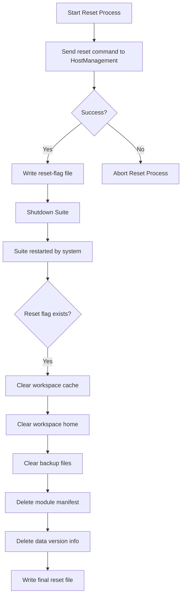

# Suite Reset Process Summary

This document outlines the sequence of operations performed during a suite reset, including interaction with HostManagement, shutdown and restart behavior, and file system cleanup.

