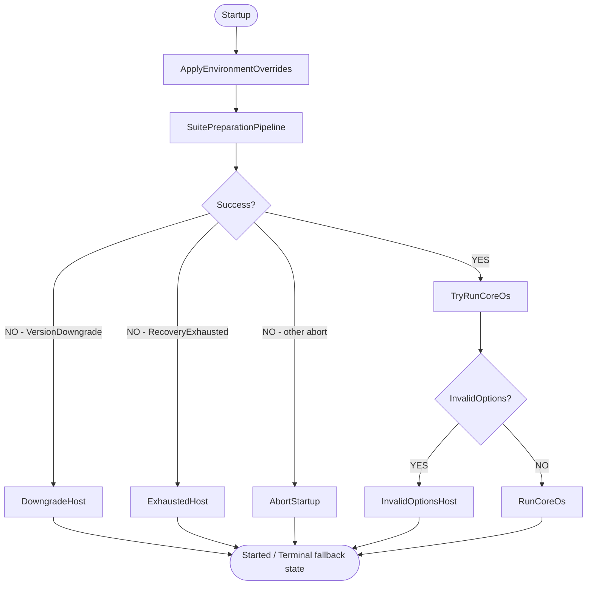
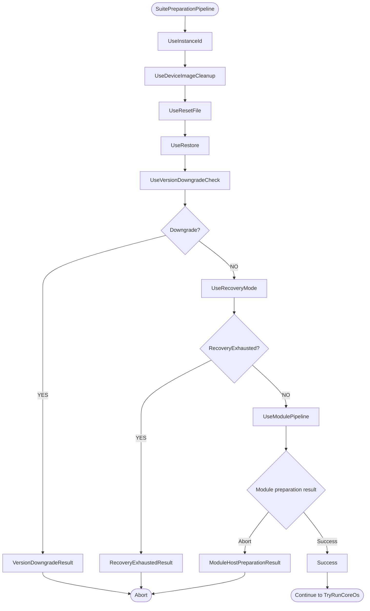
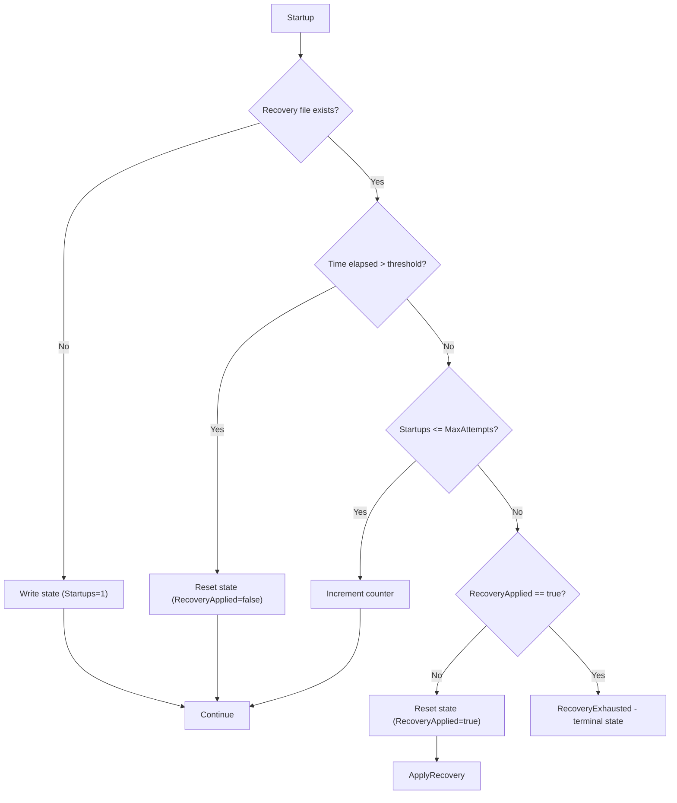

# ViciOne Suite Startup

Basically __Core.OS__ is starting a .net [WebApplication](https://learn.microsoft.com/de-de/aspnet/core/fundamentals/minimal-apis/webapplication?view=aspnetcore-9.0). The main steps of initialization are executed in this order in [Program.cs](../src/Core.OS/Program.cs):
1. _ApplyEnvironmentOverrides_ - Apply the runtime environment-variable override file to the process environment
2. _SuitePreparationPipeline_ - Ensure instance id is set, file flags (reset, backup etc.) get processed, detect version downgrades and handle automatic recovery.
3. _ModulePreparationPipeline_ - Applies enqueued package operations, loads repository/module-loader options, synchronizes modules and builds the module host (executed as the final step of the suite pipeline via `UseModulePipeline`).
4. _TryRunCoreOs_ - Inspects the preparation result, registers the remaining SDK services (options validation, OpenTelemetry, suite services), builds the host and runs it - or starts an appropriate fallback host if preparation failed.

Both pipelines derive from a shared `PreparationPipeline<TSelf, TContext>` base ([PreparationPipeline.cs](../src/Core.OS/Hosting/PreparationPipeline.cs)) that runs steps in order, logs each step's duration, and stops at the first aborting result. Any unhandled exception thrown by a step is caught and converted into a pipeline-specific abort result instead of crashing the process.

## Main Initialization

## Apply Environment Overrides

[EnvironmentOverridesLoader](../src/Core.OS/EnvironmentOverrides/EnvironmentOverridesLoader.cs) applies the runtime override file to the process environment.
The feature is off unless `VICIONE_SUITE_ENV_OVERRIDES` is set to `true` (or `1`).
That variable is a switch, not a location: it is set like any other environment variable of the service — on a package installation via `EnvironmentFile=/etc/vicione-suite/conf.d/*.conf`, in development via the launch profiles.
The file is always `env-overrides.env` in the root of the instance home directory, because the suite's own data directory is the only place it can count on being allowed to write.
The home directory is configuration, so `Instance:HomeDirectory` is read from `appsettings.json` and the process environment ahead of the host builder, where the file has to be resolved.
An instance that does not switch the feature on has no override file: nothing is applied, and `EnvironmentOverridesRepository` refuses to read or write overrides rather than storing a file that nothing would ever apply.
The same switch decides whether the settings panel is offered at all (`EnvironmentOverridesControlPanelGate`), so an instance that would not apply overrides does not present a UI for editing them.
That case is logged once at info level, naming the variable, so an instance that was expected to carry overrides can be told apart in the journal from one where they simply had no effect.

It runs before the host builder is created, so both the .NET options pipeline and libraries that read the environment directly at init (e.g. OpenTelemetry) see the same values.
Its entries win over inherited environment variables, including those from `EnvironmentFile=/etc/vicione-suite/conf.d/*.conf`.

A missing file is the normal case and changes nothing.
A file that cannot be read or parsed does not stop startup: the instance continues on the inherited environment and the failure is logged once logging is configured.
Failing hard is not an option here, because this runs ahead of the fallback host and `Restart=always` would turn a broken file into a restart loop.

### File Format

The file holds one `NAME="value"` entry per line, written and read by [EnvironmentOverridesFormat](../src/Core.OS/EnvironmentOverrides/EnvironmentOverridesFormat.cs).
The shape is `.env`-like, but the suite is the only writer and the reader accepts only what it writes — no comments, no `export`, no unquoted or single-quoted values.
Entries are written ordered by name, so related variables end up grouped in the file and the same set of overrides always produces the same file.
A name may be set only once: the panel stores a name and its value, not a sequence of assignments, so a file setting one twice is damaged rather than a last-one-wins instruction.
Anything else is treated as a damaged file rather than a dialect to interpret, because guessing at a line would apply an override nobody stored.
The settings panel is the supported way to change entries; a hand-edit that does not match the format costs the whole file (see Recovery).

Variable names must consist of ASCII letters, digits and underscores and must not start with a digit (`Core.Shared.EnvironmentOverrides.Constants.KeyPattern`).
`EnvironmentOverridesRepository` rejects a batch containing any other name in full and writes nothing, because names are written verbatim: one containing a newline or `=` could append further lines and set variables that were never submitted.

Values round-trip literally.
Quotes, backslashes, `$` and control characters are escaped on write and unescaped on read, so the value that was submitted is the value that gets set — `$` is escaped so that the file stays safe to feed to any tool that expands variable references.
A value containing NUL is rejected like an invalid name, because `Environment.SetEnvironmentVariable` truncates the value there without reporting anything, which would apply an override that differs from the stored one.

### Recovery

The file belongs to the instance it sits on, so the panel reads and writes it on the instance whose UI is used.
Both messages are instance-scoped (`IInstanceDependentRequest` / `IInstanceDependentCommand`, targeted at `IInstanceInformationProvider.Local.Id`), which means a slave is configured through the slave's own UI and never through the master's.
The resulting "Suite restart required" banner is a global event and therefore shows on every node's UI, while only the edited instance actually needs the restart.

This step sits outside every recovery mechanism below.
A reset and a restore clear the child directories of the instance home directory plus a fixed set of files in its root; the override file is not one of them, and automatic recovery only disables modules.
An override that keeps the suite from starting therefore survives every restart until the file is set aside, removed on the machine, or the feature is switched off again.

Taking the file out of the picture is the recovery path, and it is enough: the instance comes back up on the inherited environment, and the settings panel can then be used to store a corrected set.
An operator who cannot reach a shell does this from the failsafe debug page, which renames the file to `env-overrides.env.disabled` and restarts the instance (see [ADR-004](ADRs/ADR-004-failsafe-debug-surface.md)).
Nothing resolves that name for reading, so the file stays on disk and readable while no longer being applied; the boot that follows logs a warning naming it, so the journal shows why the instance came back on the inherited environment.
Repairing a malformed file by hand is not supported — the loader rejects the file as a whole rather than the offending line, so a partial fix still applies nothing.

## Suite Preparation Pipeline

`SuitePreparationPipeline` ([SuitePreparationPipeline.cs](../src/Core.OS/Hosting/SuitePreparationPipeline.cs)) runs the following steps in order (see [SuitePreparationPipelineExtensions.cs](../src/Core.OS/Hosting/Extensions/SuitePreparationPipelineExtensions.cs)). If any step returns an abort result, execution stops immediately and the result is propagated to `TryRunCoreOs`, which decides how to fall back.

- **UseInstanceId** - ensures the instance id file exists and logs the running version/branch.
- **UseDeviceImageCleanup** - deletes leftover device image files from a previously failed flash attempt.
- **UseResetFile** - resets the workspace if a reset flag file is present.
- **UseRestore** - restores a backup if a restore flag file is present.
- **UseVersionDowngradeCheck** - detects a version downgrade and, if found, returns `VersionDowngradePreparationResult` so a minimal downgrade web host is started instead of the full application.
- **UseRecoveryMode** - implements the automatic recovery mechanism (see below). Applies recovery, ensures the module manifest file exists, or aborts with `RecoveryExhaustedPreparationResult` if recovery attempts are exhausted.
- **UseModulePipeline** - constructs a `ModulePreparationContext` and runs the nested `ModulePreparationPipeline` (see below), then propagates its result and copies `ModuleHost`, `ModuleOptionsStore` and `RepositoryOptionsCache` back onto the suite context for later service registration.

## Module Preparation Pipeline

`ModulePreparationPipeline` ([ModulePreparationPipeline.cs](../src/Core.OS/Modules/Hosting/ModulePreparationPipeline.cs)) replaces the former monolithic `AddModuleHost` method with discrete, individually abortable steps (see [ModulePreparationPipelineExtensions.cs](../src/Core.OS/Modules/Hosting/ModulePreparationPipelineExtensions.cs)). It is executed as the last step of the suite pipeline via `UseModulePipeline`.

- **UseApplyEnqueuedOperations** - applies enqueued install/uninstall operations to the module manifest and stores the resulting manifest in the context. A corrupt manifest surfaces as a `ModuleHostPreparationResult` abort.
- **UseRepositoryOptions** - migrates configured artifact repositories and loads repository options into an `ArtifactRepositoryOptionsCache` kept in the context.
- **UseModuleLoaderOptions** - combines the module manifest with appsettings/environment/dev-sample modules into `ModuleOptions`.
- **UseModuleSynchronization** - synchronizes enabled module packages (download/update/cleanup orphaned versions), persists resolved package versions back to the manifest.
- **UseModuleHost** - builds the module host and loads module assemblies via `ModuleHostBuilder`, calling `AddControllersWithViews()` as part of the build. Sets `ModuleHost` and `ModuleOptionsStore` on the context.

Any exception thrown by a step (e.g. a failed synchronization or module load) is caught by the pipeline base and converted into a `ModuleHostPreparationResult` abort, which bubbles up through `UseModulePipeline` to `TryRunCoreOs`.

## TryRunCoreOs

`TryRunCoreOs` ([WebApplicationBuilderExtensions.cs](../src/Core.OS/Extensions/WebApplicationBuilderExtensions.cs)) inspects the `IPreparationResult` returned by the suite pipeline and decides how to proceed:

- `VersionDowngradePreparationResult` - starts a minimal downgrade web host serving a static downgrade page, then stops.
- `RecoveryExhaustedPreparationResult` - starts a terminal fallback host in a degraded error state, serving the failsafe debug page, so the service manager does not keep restarting the process.
- Any other `IPreparationAbortResult` (e.g. module host preparation failures) - logs the abort reason and stops startup.
- Otherwise (success) - registers the remaining services (`AddCoreOptions`, `AddSuiteOpenTelemetry`, `AddSuiteServices`), builds the host, and either starts the same fallback host for invalid options or runs the full Core.OS application.

## Automatic Recovery

If the suite fails on startup x times within a configurable time frame, a backup of the current module configuration is created and all modules are disabled for the next startup attempt. If the suite still can't start up successfully, it enters a terminal degraded state by starting a fallback host with an error message.

