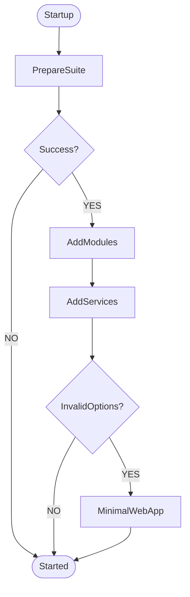
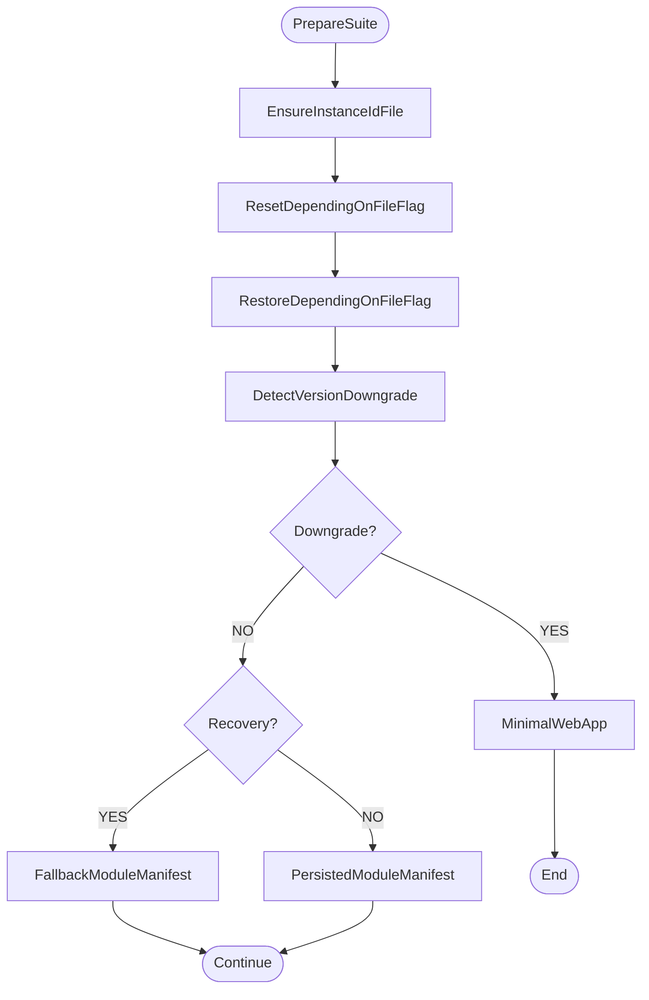

# ViciOne Suite Startup

Basically __Core.OS__ is starting a .net [WebApplication](https://learn.microsoft.com/de-de/aspnet/core/fundamentals/minimal-apis/webapplication?view=aspnetcore-9.0). The main steps of initialization are executed in this order in [Program.cs](../src/Core.OS/Program.cs):
1. _PrepareSuite_ - Ensure instance id is set, file flags (reset, backup etc.) get processed.
2. _AddModules_ - Synchronize, create dependency context and load backend modules into the application
3. _AddServices_ - Register services to provide SDK implementations etc.
4. _RunCoreOs_ - Use services, initialize UIHost modules, run Core.OS WebApplication

## Main Initialization

## Prepare Suite

If this step is successfull the initialization proceeds to step _AddModules_. If a version downgrade gets detected, a minimal web host gets started, instead of the full web application. It's displaying the downgrade page as static html.

