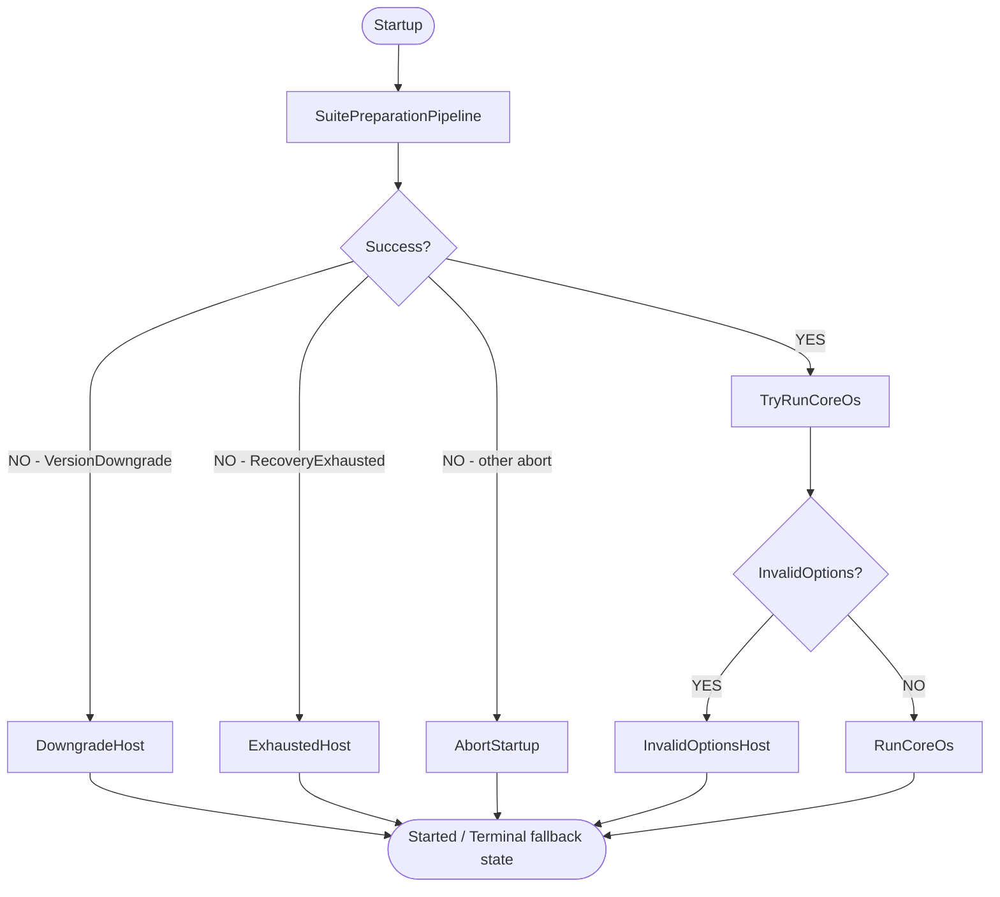
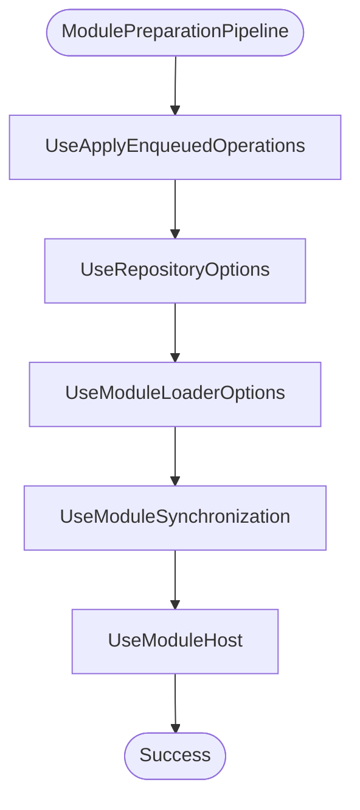
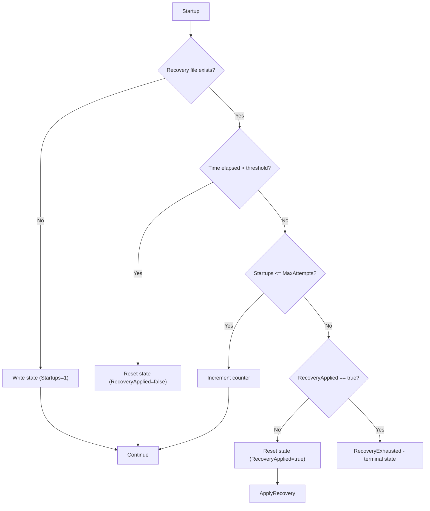

# ViciOne Suite Startup

Basically __Core.OS__ is starting a .net [WebApplication](https://learn.microsoft.com/de-de/aspnet/core/fundamentals/minimal-apis/webapplication?view=aspnetcore-9.0). The main steps of initialization are executed in this order in [Program.cs](../src/Core.OS/Program.cs):
1. _SuitePreparationPipeline_ - Ensure instance id is set, file flags (reset, backup etc.) get processed, detect version downgrades and handle automatic recovery.
2. _ModulePreparationPipeline_ - Applies enqueued package operations, loads repository/module-loader options, synchronizes modules and builds the module host (executed as the final step of the suite pipeline via `UseModulePipeline`).
3. _TryRunCoreOs_ - Inspects the preparation result, registers the remaining SDK services (options validation, OpenTelemetry, suite services), builds the host and runs it - or starts an appropriate fallback host if preparation failed.

Both pipelines derive from a shared `PreparationPipeline<TSelf, TContext>` base ([PreparationPipeline.cs](../src/Core.OS/Hosting/PreparationPipeline.cs)) that runs steps in order, logs each step's duration, and stops at the first aborting result. Any unhandled exception thrown by a step is caught and converted into a pipeline-specific abort result instead of crashing the process.

## Main Initialization

## Suite Preparation Pipeline

`SuitePreparationPipeline` ([SuitePreparationPipeline.cs](../src/Core.OS/Hosting/SuitePreparationPipeline.cs)) runs the following steps in order (see [SuitePreparationPipelineExtensions.cs](../src/Core.OS/Hosting/Extensions/SuitePreparationPipelineExtensions.cs)). If any step returns an abort result, execution stops immediately and the result is propagated to `TryRunCoreOs`, which decides how to fall back.

- **UseInstanceId** - ensures the instance id file exists and logs the running version/branch.
- **UseDeviceImageCleanup** - deletes leftover device image files from a previously failed flash attempt.
- **UseResetFile** - resets the workspace if a reset flag file is present.
- **UseRestore** - restores a backup if a restore flag file is present.
- **UseVersionDowngradeCheck** - detects a version downgrade and, if found, returns `VersionDowngradePreparationResult` so a minimal downgrade web host is started instead of the full application.
- **UseRecoveryMode** - implements the automatic recovery mechanism (see below). Applies recovery, ensures the module manifest file exists, or aborts with `RecoveryExhaustedPreparationResult` if recovery attempts are exhausted.
- **UseModulePipeline** - constructs a `ModulePreparationContext` and runs the nested `ModulePreparationPipeline` (see below), then propagates its result and copies `ModuleHost`, `ModuleOptionsStore` and `RepositoryOptionsCache` back onto the suite context for later service registration.

## Module Preparation Pipeline

`ModulePreparationPipeline` ([ModulePreparationPipeline.cs](../src/Core.OS/Modules/Hosting/ModulePreparationPipeline.cs)) replaces the former monolithic `AddModuleHost` method with discrete, individually abortable steps (see [ModulePreparationPipelineExtensions.cs](../src/Core.OS/Modules/Hosting/ModulePreparationPipelineExtensions.cs)). It is executed as the last step of the suite pipeline via `UseModulePipeline`.

- **UseApplyEnqueuedOperations** - applies enqueued install/uninstall operations to the module manifest and stores the resulting manifest in the context. A corrupt manifest surfaces as a `ModuleHostPreparationResult` abort.
- **UseRepositoryOptions** - migrates configured artifact repositories and loads repository options into an `ArtifactRepositoryOptionsCache` kept in the context.
- **UseModuleLoaderOptions** - combines the module manifest with appsettings/environment/dev-sample modules into `ModuleOptions`.
- **UseModuleSynchronization** - synchronizes enabled module packages (download/update/cleanup orphaned versions), persists resolved package versions back to the manifest.
- **UseModuleHost** - builds the module host and loads module assemblies via `ModuleHostBuilder`, calling `AddControllersWithViews()` as part of the build. Sets `ModuleHost` and `ModuleOptionsStore` on the context.

Any exception thrown by a step (e.g. a failed synchronization or module load) is caught by the pipeline base and converted into a `ModuleHostPreparationResult` abort, which bubbles up through `UseModulePipeline` to `TryRunCoreOs`.

## TryRunCoreOs

`TryRunCoreOs` ([WebApplicationBuilderExtensions.cs](../src/Core.OS/Extensions/WebApplicationBuilderExtensions.cs)) inspects the `IPreparationResult` returned by the suite pipeline and decides how to proceed:

- `VersionDowngradePreparationResult` - starts a minimal downgrade web host serving a static downgrade page, then stops.
- `RecoveryExhaustedPreparationResult` - starts a terminal fallback host in a degraded error state so the service manager does not keep restarting the process.
- Any other `IPreparationAbortResult` (e.g. module host preparation failures) - logs the abort reason and stops startup.
- Otherwise (success) - registers the remaining services (`ConfigureAndValidateOptions`, `AddSuiteOpenTelemetry`, `AddSuiteServices`), builds the host, and either starts a fallback host for invalid options or runs the full Core.OS application.

## Automatic Recovery

If the suite fails on startup x times within a configurable time frame, a backup of the current module configuration is created and all modules are disabled for the next startup attempt. If the suite still can't start up successfully, it enters a terminal degraded state by starting a fallback host with an error message.

