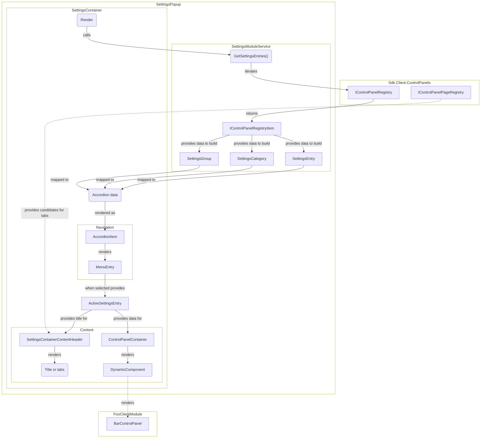

[[_TOC_]]

## Introduction

This document describes aspects of settings implementation.

## Architecture

```mermaid
flowchart TD
    subgraph SdkClientControlPanels["Sdk.Client.ControlPanels"]
        IControlPanelRegistry
        IControlPanelPageRegistry
    end

    subgraph FooClientModule
        BarControlPanel
    end

    subgraph SettingsPopup
        subgraph SettingsModuleService
            GetSettingsEntries("GetSettingsEntries()")
            IControlPanelRegistryItem
            SettingsGroup
            SettingsCategory
            SettingsEntry

            GetSettingsEntries-- "iterates" -->IControlPanelRegistry
            IControlPanelRegistry-- "returns" -->IControlPanelRegistryItem
            IControlPanelRegistryItem-- "provides data to build" -->SettingsGroup
            IControlPanelRegistryItem-- "provides data to build" -->SettingsCategory
            IControlPanelRegistryItem-- "provides data to build" -->SettingsEntry
        end

        subgraph SettingsContainer
            SettingsContainerRender("Render")
            ActiveSettingsEntry
            AccordionData("Accordion data")

            subgraph Navigation
                AccordionItem
                MenuEntry
            end

            subgraph Content
                SettingsContainerContentHeader
                ControlPanelContainer
                DynamicComponent
                TitleOrTabs("Title or tabs")
            end

            SettingsContainerRender-- "calls" -->GetSettingsEntries

            SettingsGroup-- "mapped to" -->AccordionData
            SettingsCategory-- "mapped to" -->AccordionData
            SettingsEntry-- "mapped to" -->AccordionData

            AccordionData-- "rendered as" -->AccordionItem

            AccordionItem-- "renders" -->MenuEntry
            MenuEntry-- "when selected provides" -->ActiveSettingsEntry

            ActiveSettingsEntry-- "provides title for" -->SettingsContainerContentHeader
            SettingsContainerContentHeader-- "renders"-->TitleOrTabs
            ActiveSettingsEntry-- "provides data for" -->ControlPanelContainer

            ControlPanelContainer-- "renders" -->DynamicComponent
            DynamicComponent-. "renders" .->BarControlPanel
        end
    end

    IControlPanelPageRegistry-. "provides candidates for tabs" .->SettingsContainerContentHeader

    classDef cluster fill:#ffffff10
    classDef authorization stroke:#ffff00
    classDef saveCancelHandler stroke:#00ff00

    class ModuleAuthorizeAttribute,IAuthorizationRequirement authorization;
    class IControlPanelSaveHandler,IControlPanelCancelHandler,SaveButton,CancelButton saveCancelHandler;
```