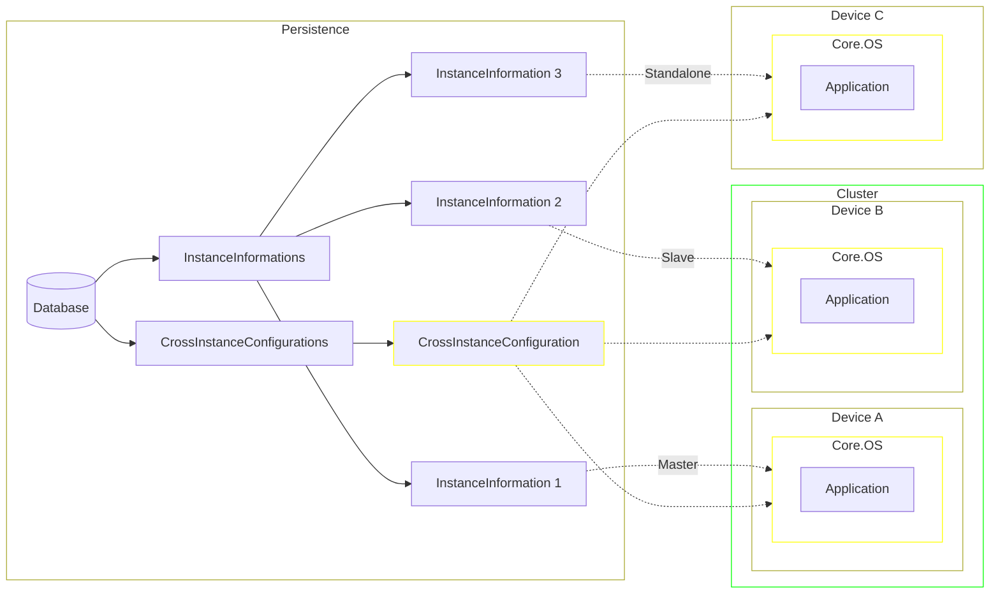

[[_TOC_]]

## Introduction

This document describes aspects of the `Core.OS` project.

## Architecture

```mermaid
flowchart LR
    subgraph Persistence
        Database[(Database)]
        InstanceInformations
        InstanceInformation1["InstanceInformation 1"]
        InstanceInformation2["InstanceInformation 2"]
        InstanceInformation3["InstanceInformation 3"]
        CrossInstanceConfigurations
        CrossInstanceConfiguration

        Database-->InstanceInformations
        InstanceInformations-->InstanceInformation1
        InstanceInformations-->InstanceInformation2
        InstanceInformations-->InstanceInformation3
        Database-->CrossInstanceConfigurations
        CrossInstanceConfigurations-->CrossInstanceConfiguration
    end
    
    subgraph Cluster
        subgraph Device1["Device A"]
            subgraph CoreOS1["Core.OS"]
                Application1["Application"]
            end
        end

        subgraph Device2["Device B"]
            subgraph CoreOS2["Core.OS"]
                Application2["Application"]
            end
        end
    end

    subgraph Device3["Device C"]
        subgraph CoreOS3["Core.OS"]
            Application3["Application"]
        end
    end

    InstanceInformation1-. Master .->CoreOS1
    InstanceInformation2-. Slave .->CoreOS2
    InstanceInformation3-. Standalone .->CoreOS3
    CrossInstanceConfiguration-.->CoreOS1
    CrossInstanceConfiguration-.->CoreOS2
    CrossInstanceConfiguration-.->CoreOS3

    classDef cluster fill:#ffffff10
    classDef crossInstance stroke:#ffff00

    style Cluster stroke:#00ff00

    class CrossInstanceConfiguration,CoreOS1,CoreOS2,CoreOS3 crossInstance;
```
 
